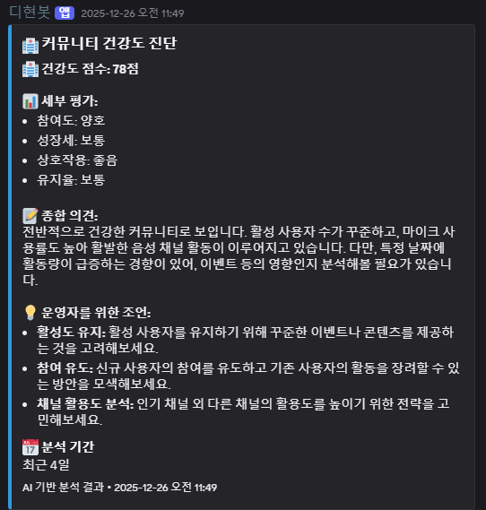

# 디스코드 음성 활동 분석 봇 (DHyunBot)

Discord 서버의 음성 채널 활동을 실시간으로 수집·분석하고,
Redis + PostgreSQL 기반으로 통계를 집계하며,
Gemini AI를 통해 자동 리포트를 생성하는 봇입니다.

> **Monorepo Structure**: 이 프로젝트는 npm workspaces를 사용하는 monorepo입니다.

---

## ✨ Features

- 🎤 Discord 음성 채널 Join / Leave / Mute 이벤트 실시간 수집
- ⏱ Redis 세션 기반 음성 체류 시간 누적 (TTL 기반 세션 관리)
- 📊 PostgreSQL 일/월 단위 통계 집계
- 👥 유저 간 동시 체류 시간 분석 (가장 자주 함께한 유저)
- 🤖 Gemini AI 기반 자동 분석 리포트 생성
- 🧹 서버 비정상 종료 대비 세션 Flush 전략 적용
- 🌐 Next.js 기반 웹 대시보드 (프로토타입)

---

## 📁 Project Structure

```
nest-dhyunbot/
├── apps/                  # Applications
│   ├── api/              # NestJS backend API
│   └── web/              # Next.js frontend dashboard
├── libs/                  # Shared libraries
│   └── shared/           # Common types and utilities
├── docker-compose.yml     # Docker orchestration
└── package.json          # Monorepo root configuration
```

---

## 🛠 Tech Stack

### Backend (apps/api)

- NestJS 10.4
- TypeORM
- PostgreSQL 15
- Redis 7
- Discord.js 14

### Frontend (apps/web)

- Next.js 16
- React 19
- Tailwind CSS

### Shared (libs/shared)

- TypeScript
- Common types and interfaces

### Infrastructure

- Docker / Docker Compose
- npm workspaces

### AI

- Gemini API

## 🧩 Architecture

```bash
Discord Gateway
↓
NestJS Gateway
↓
Redis (Session / TTL)
↓
PostgreSQL (Daily / Monthly Stats)
↓
Gemini AI → Discord Embed Report
```

## 🚀 Getting Started

### Prerequisites

- Node.js >= 18.0.0
- npm >= 9.0.0
- Docker & Docker Compose (선택 사항)

### 1. Clone Repository

```bash
git clone https://github.com/sambart/nestjs-dhyunbot
cd nest-dhyunbot
```

### 2. Install Dependencies

모노레포 루트에서 한 번에 모든 패키지 설치:

```bash
npm install
```

### 3. Environment Setup

`.env.example`을 복사하여 `.env` 파일 생성:

```bash
cp .env.example .env
```

`.env` 파일을 편집하여 실제 값 입력:

```bash
# Database
DATABASE_HOST=db
DATABASE_PORT=5432
DATABASE_USER=dhyun
DATABASE_PASSWORD=YOUR_PASSWORD
DATABASE_NAME=dhyunbot

# Discord Bot
DISCORD_API_TOKEN=YOUR_BOT_TOKEN
DISCORD_CLIENT_ID=YOUR_CLIENT_ID
DISCORD_COMMAND_PREFIX=!

# Node Environment
NODE_ENV=development

# Redis
REDIS_HOST=redis
REDIS_PORT=6379
REDIS_PASSWORD=YOUR_PASSWORD

# Gemini API
GEMINI_API_KEY=YOUR_GEMINI_API_KEY

# JWT (for web authentication)
JWT_SECRET=YOUR_JWT_SECRET
```

### 4. Run with Docker Compose (권장)

```bash
docker compose up --build
```

서비스 접근:
- API: http://localhost:3000
- Web Dashboard: http://localhost:4000
- PostgreSQL: localhost:5432
- Redis: localhost:6379

### 5. Run Locally (개발 모드)

#### Terminal 1: API Server

```bash
npm run api:dev
```

#### Terminal 2: Web Server

```bash
npm run web:dev
```

#### Terminal 3: Database & Redis

```bash
docker compose up db redis
```

---

## 📸 Execution Result

### 🎤 음성 채널 활동 분석 리포트 (Discord Embed)


