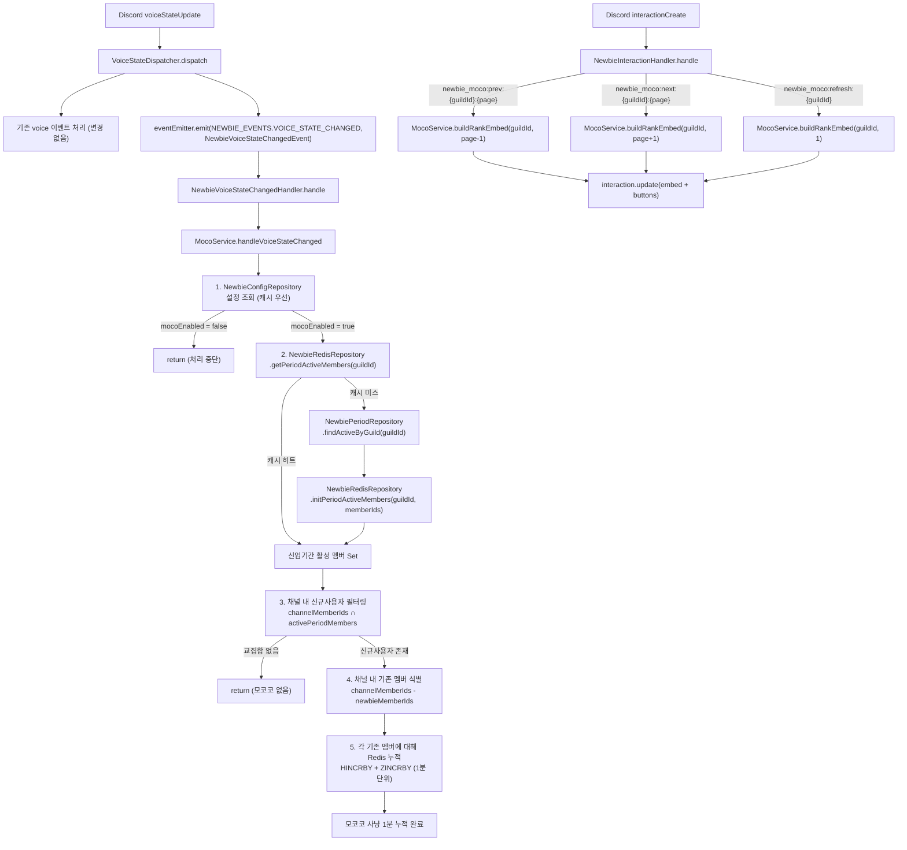

# 단위 D: 모코코 사냥 (F-NEWBIE-003) — 구현 계획

## 범위

PRD F-NEWBIE-003 구현.

기존 멤버가 신규사용자(신입기간 중인 멤버)와 같은 음성 채널에 동시 접속한 시간을 "모코코 사냥" 시간으로 Redis에 누적한다. TOP N 순위 Embed를 Discord 채널에 게시하고, 페이지네이션 버튼 및 갱신 버튼 인터랙션을 처리한다.

---

## 전제 조건 (공통 모듈 완성 상태 가정)

이 단위는 공통 모듈(Unit A: `1-newbie-core`)이 이미 완성된 상태에서 착수한다.
아래 파일들이 이미 존재한다고 가정한다.

| 파일 | 설명 |
|------|------|
| `apps/api/src/newbie/infrastructure/newbie-cache.keys.ts` | Redis 키 팩토리 (`NewbieKeys`) |
| `apps/api/src/newbie/infrastructure/newbie-redis.repository.ts` | Redis CRUD (`NewbieRedisRepository`) |
| `apps/api/src/newbie/infrastructure/newbie-config.repository.ts` | `NewbieConfig` DB CRUD |
| `apps/api/src/newbie/infrastructure/newbie-mission.repository.ts` | `NewbieMission` DB CRUD |
| `apps/api/src/newbie/infrastructure/newbie-period.repository.ts` | `NewbiePeriod` DB CRUD |
| `apps/api/src/newbie/domain/newbie-config.entity.ts` | `NewbieConfig` 엔티티 (이미 존재) |
| `apps/api/src/newbie/domain/newbie-mission.entity.ts` | `NewbieMission` 엔티티 (`MissionStatus` enum 포함, 이미 존재) |
| `apps/api/src/newbie/domain/newbie-period.entity.ts` | `NewbiePeriod` 엔티티 (이미 존재) |
| `apps/api/src/event/newbie/newbie-events.ts` | `NEWBIE_EVENTS`, `NewbieVoiceStateChangedEvent` |
| `apps/api/src/newbie/newbie.module.ts` | `NewbieModule` (이 단위 provider 등록 포함) |

이 단위가 새로 생성하는 파일만 아래에 기술한다.

---

## 생성할 파일

```
apps/api/src/newbie/moco/moco.service.ts
apps/api/src/event/newbie/newbie-voice-state-changed.handler.ts
apps/api/src/event/newbie/newbie-events.ts          ← NEWBIE_EVENTS 상수 추가 (수정)
apps/api/src/event/newbie/newbie-interaction.handler.ts
```

## 수정할 파일

```
apps/api/src/event/voice/voice-state.dispatcher.ts  ← NEWBIE_EVENTS.VOICE_STATE_CHANGED 발행 추가
apps/api/src/event/discord-events.module.ts         ← NewbieModule import, 핸들러 등록
```

---

## 다이어그램



---

## 구현 상세

### 1. `apps/api/src/event/newbie/newbie-events.ts`

공통 모듈(Unit A)에서 생성된 파일이다. 이미 `NEWBIE_EVENTS.VOICE_STATE_CHANGED`와 `NewbieVoiceStateChangedEvent`가 정의되어 있어야 한다. 이 단위에서 **신규 수정은 없다.** 내용을 아래와 같이 확인만 한다.

```typescript
// apps/api/src/event/newbie/newbie-events.ts

export const NEWBIE_EVENTS = {
  /** voiceStateUpdate 발생 시 MocoService 처리용 — Dispatcher에서 추가 발행 */
  VOICE_STATE_CHANGED: 'newbie.voice-state-changed',
} as const;

export class NewbieVoiceStateChangedEvent {
  constructor(
    public readonly guildId: string,
    /** 이벤트 발생 이후 현재 채널 ID. 퇴장 시 null */
    public readonly channelId: string | null,
    /** 이벤트 발생 이전 채널 ID. 입장 시 null */
    public readonly oldChannelId: string | null,
    /** 현재 채널(channelId)의 모든 멤버 Discord ID 목록. 퇴장 시 [] */
    public readonly channelMemberIds: string[],
  ) {}
}
```

---

### 2. `apps/api/src/newbie/moco/moco.service.ts`

모코코 사냥의 핵심 비즈니스 로직을 담당한다. 음성 상태 변경 이벤트를 수신해 시간을 누적하고, 순위 Embed를 생성한다.

#### 의존성

- `NewbieConfigRepository` — `NewbieConfig` 설정 조회 (캐시 우선)
- `NewbieRedisRepository` — `getPeriodActiveMembers`, `initPeriodActiveMembers`, `incrMocoMinutes`, `incrMocoRank`, `getMocoRankPage`, `getMocoHunterDetail`, `getMocoRankCount`
- `NewbieMissionRepository` — `findActiveByMember` (신규사용자의 IN_PROGRESS 미션 확인)
- `NewbiePeriodRepository` — `findActiveByGuild` (신입기간 활성 멤버 전체 조회 — 캐시 미스 시)
- `NewbieConfigRepository.updateMocoRankMessageId` — 최초 Embed 전송 후 메시지 ID 저장
- `@InjectDiscordClient()` — Discord Client (채널 조회 및 메시지 전송/수정용)

#### 상수

```typescript
/** 페이지당 사냥꾼 수 */
const PAGE_SIZE = 1;

/** 모코코 사냥 버튼 customId 접두사 */
const CUSTOM_ID = {
  PREV: 'newbie_moco:prev:',
  NEXT: 'newbie_moco:next:',
  REFRESH: 'newbie_moco:refresh:',
} as const;
```

#### 메서드 시그니처 및 구현

```typescript
import { InjectDiscordClient } from '@discord-nestjs/core';
import { Injectable, Logger } from '@nestjs/common';
import {
  ActionRowBuilder,
  ButtonBuilder,
  ButtonStyle,
  Client,
  EmbedBuilder,
  TextChannel,
} from 'discord.js';

import { NewbieConfigRepository } from '../infrastructure/newbie-config.repository';
import { NewbieMissionRepository } from '../infrastructure/newbie-mission.repository';
import { NewbiePeriodRepository } from '../infrastructure/newbie-period.repository';
import { NewbieRedisRepository } from '../infrastructure/newbie-redis.repository';

const PAGE_SIZE = 1;

const CUSTOM_ID = {
  PREV: 'newbie_moco:prev:',
  NEXT: 'newbie_moco:next:',
  REFRESH: 'newbie_moco:refresh:',
} as const;

@Injectable()
export class MocoService {
  private readonly logger = new Logger(MocoService.name);

  constructor(
    private readonly configRepo: NewbieConfigRepository,
    private readonly missionRepo: NewbieMissionRepository,
    private readonly periodRepo: NewbiePeriodRepository,
    private readonly newbieRedis: NewbieRedisRepository,
    @InjectDiscordClient() private readonly discordClient: Client,
  ) {}

  /**
   * voiceStateUpdate 이벤트 수신 시 모코코 사냥 시간 1분 누적.
   *
   * 처리 흐름:
   * 1. NewbieConfig 조회 — mocoEnabled 확인
   * 2. 신입기간 활성 멤버 Set 조회 (캐시 우선, 미스 시 DB → 캐시 초기화)
   * 3. 채널 내 신규사용자 식별 (channelMemberIds ∩ activePeriodMembers)
   *    — 추가로 각 신규사용자의 미션 상태가 IN_PROGRESS인지 확인
   * 4. 채널 내 기존 멤버 식별 (channelMemberIds - newbieMemberIds)
   * 5. 각 기존 멤버(hunterId)에 대해:
   *    - HINCRBY newbie:moco:total:{guildId}:{hunterId} {newbieMemberId} 1
   *    - ZINCRBY newbie:moco:rank:{guildId} 1 {hunterId}
   */
  async handleVoiceStateChanged(
    guildId: string,
    channelId: string | null,
    channelMemberIds: string[],
  ): Promise<void>

  /**
   * 순위 Embed를 생성하고 설정된 채널에 전송(최초) 또는 수정(이후)한다.
   *
   * - 최초 전송: mocoRankMessageId가 없을 때 새 메시지 전송 후 DB에 messageId 저장
   * - 이후 호출: 기존 메시지를 editMessage로 수정
   *
   * 반환값: 생성된 EmbedBuilder + ActionRowBuilder 페이로드 (인터랙션 핸들러에서 재사용)
   */
  async sendOrUpdateRankEmbed(guildId: string, page: number): Promise<void>

  /**
   * 순위 Embed + 페이지네이션 버튼을 구성하여 반환한다.
   * 인터랙션 핸들러(NewbieInteractionHandler)에서 호출하여 interaction.update()에 사용.
   *
   * @param guildId 서버 ID
   * @param page 표시할 페이지 (1-indexed)
   * @returns { embed, components } — interaction.update() 페이로드
   */
  async buildRankPayload(
    guildId: string,
    page: number,
  ): Promise<{
    embeds: EmbedBuilder[];
    components: ActionRowBuilder<ButtonBuilder>[];
  }>

  /** 내부: 사냥꾼 1명에 대한 순위 Embed 구성 */
  private buildHunterEmbed(
    rank: number,
    hunterId: string,
    hunterName: string,
    totalMinutes: number,
    details: Record<string, number>,   // { newbieMemberId → minutes }
    newbieNames: Record<string, string>, // { newbieMemberId → displayName }
    currentPage: number,
    totalPages: number,
    autoRefreshMinutes: number | null,
  ): EmbedBuilder

  /** 내부: 페이지네이션 + 갱신 버튼 ActionRow 구성 */
  private buildButtons(
    guildId: string,
    currentPage: number,
    totalPages: number,
  ): ActionRowBuilder<ButtonBuilder>
}
```

#### `handleVoiceStateChanged` 구현 세부

```typescript
async handleVoiceStateChanged(
  guildId: string,
  channelId: string | null,
  channelMemberIds: string[],
): Promise<void> {
  // 1. 채널 ID 없음(퇴장)이거나 채널에 멤버가 2명 미만이면 처리 불필요
  if (!channelId || channelMemberIds.length < 2) return;

  // 2. NewbieConfig 조회 — mocoEnabled 확인 (캐시 우선)
  const config = await this.configRepo.findByGuildId(guildId);
  if (!config?.mocoEnabled) return;

  // 3. 신입기간 활성 멤버 Set 조회 (Redis Set)
  let activePeriodMembers = await this.newbieRedis.getPeriodActiveMembers(guildId);

  if (activePeriodMembers.length === 0) {
    // 캐시 미스 또는 실제로 활성 멤버 없음 — DB 조회 후 캐시 초기화
    const periods = await this.periodRepo.findActiveByGuild(guildId);
    const memberIds = periods.map((p) => p.memberId);
    if (memberIds.length > 0) {
      await this.newbieRedis.initPeriodActiveMembers(guildId, memberIds);
      activePeriodMembers = memberIds;
    }
  }

  // 4. 채널 내 신규사용자 식별
  const activePeriodSet = new Set(activePeriodMembers);
  const newbieCandidates = channelMemberIds.filter((id) => activePeriodSet.has(id));
  if (newbieCandidates.length === 0) return;

  // 5. 각 신규사용자의 미션 상태 IN_PROGRESS 확인 (병렬)
  const missionChecks = await Promise.all(
    newbieCandidates.map((id) => this.missionRepo.findActiveByMember(guildId, id)),
  );
  const confirmedNewbies = newbieCandidates.filter((_, i) => missionChecks[i] !== null);
  if (confirmedNewbies.length === 0) return;

  // 6. 기존 멤버(사냥꾼) 식별
  const newbieSet = new Set(confirmedNewbies);
  const hunters = channelMemberIds.filter((id) => !newbieSet.has(id));
  if (hunters.length === 0) return;

  // 7. Redis 누적 (HINCRBY + ZINCRBY) — pipeline으로 일괄 처리
  for (const hunterId of hunters) {
    for (const newbieId of confirmedNewbies) {
      await this.newbieRedis.incrMocoMinutes(guildId, hunterId, newbieId, 1);
    }
    await this.newbieRedis.incrMocoRank(guildId, hunterId, confirmedNewbies.length);
  }
}
```

**설계 결정 근거:**
- `channelMemberIds.length < 2`: 혼자 있는 채널은 동시 접속이 성립하지 않으므로 Early Return.
- 신입기간 활성 멤버 캐시가 비어있을 때 DB 조회 후 `initPeriodActiveMembers` 호출. 실제로 신입기간 멤버가 없는 경우(memberIds 빈 배열)에는 `initPeriodActiveMembers` 호출하지 않는다(Redis Set 키를 불필요하게 생성하지 않음).
- 미션 상태 확인을 `newbieCandidates`에 대해서만 수행해 DB 조회를 최소화한다.
- `incrMocoRank`의 score 증분을 `confirmedNewbies.length`로 설정: 사냥꾼 한 명이 동시에 여러 신규사용자와 함께 있을 경우 총 사냥 시간이 그만큼 누적됨을 반영.

#### `buildRankPayload` 구현 세부

```typescript
async buildRankPayload(
  guildId: string,
  page: number,
): Promise<{
  embeds: EmbedBuilder[];
  components: ActionRowBuilder<ButtonBuilder>[];
}> {
  const totalCount = await this.newbieRedis.getMocoRankCount(guildId);
  const totalPages = Math.max(1, totalCount);  // 페이지당 1명이므로 totalPages = totalCount

  // page 범위 클램핑
  const safePage = Math.min(Math.max(1, page), totalPages);

  // ZREVRANGE WITH SCORES — 0-indexed offset
  const rankEntries = await this.newbieRedis.getMocoRankPage(guildId, safePage, PAGE_SIZE);
  // rankEntries: [{ hunterId: string, score: number }]

  if (rankEntries.length === 0) {
    const emptyEmbed = new EmbedBuilder()
      .setTitle('모코코 사냥 순위')
      .setDescription('아직 기록된 사냥꾼이 없습니다.');
    return {
      embeds: [emptyEmbed],
      components: [],
    };
  }

  const { hunterId, score: totalMinutes } = rankEntries[0];

  // 사냥꾼별 신규사용자 상세 조회
  const details = await this.newbieRedis.getMocoHunterDetail(guildId, hunterId);
  // details: Record<newbieMemberId, minutes>

  // Discord displayName 조회 (guild.members.fetch — 캐시 우선)
  const guild = await this.discordClient.guilds.fetch(guildId);
  const hunterMember = await guild.members.fetch(hunterId).catch(() => null);
  const hunterName = hunterMember?.displayName ?? hunterId;

  const newbieNames: Record<string, string> = {};
  for (const newbieId of Object.keys(details)) {
    const m = await guild.members.fetch(newbieId).catch(() => null);
    newbieNames[newbieId] = m?.displayName ?? newbieId;
  }

  const config = await this.configRepo.findByGuildId(guildId);
  const autoRefreshMinutes = config?.mocoAutoRefreshMinutes ?? null;

  const embed = this.buildHunterEmbed(
    safePage,       // rank = 페이지 번호 = 순위
    hunterId,
    hunterName,
    Math.round(totalMinutes),
    details,
    newbieNames,
    safePage,
    totalPages,
    autoRefreshMinutes,
  );

  const components = this.buildButtons(guildId, safePage, totalPages);

  return { embeds: [embed], components: [components] };
}
```

#### `buildHunterEmbed` 구현 세부

PRD F-NEWBIE-003 Embed 포맷을 따른다.

```typescript
private buildHunterEmbed(
  rank: number,
  _hunterId: string,
  hunterName: string,
  totalMinutes: number,
  details: Record<string, number>,
  newbieNames: Record<string, string>,
  currentPage: number,
  totalPages: number,
  autoRefreshMinutes: number | null,
): EmbedBuilder {
  const detailLines = Object.entries(details)
    .sort(([, a], [, b]) => b - a)  // 많이 함께한 순 정렬
    .map(([newbieId, minutes]) => {
      const name = newbieNames[newbieId] ?? newbieId;
      return `– ${name} 🌱: ${minutes}분`;
    })
    .join('\n');

  const footer = autoRefreshMinutes
    ? `페이지 ${currentPage}/${totalPages} | 자동 갱신 ${autoRefreshMinutes}분`
    : `페이지 ${currentPage}/${totalPages}`;

  return new EmbedBuilder()
    .setTitle(`모코코 사냥 TOP ${rank} — ${hunterName} 🌱`)
    .setDescription(
      `총 모코코 사냥 시간: ${totalMinutes}분\n\n도움을 받은 모코코들:\n${detailLines || '없음'}`,
    )
    .setFooter({ text: footer })
    .setColor(0x5865f2);
}
```

#### `buildButtons` 구현 세부

```typescript
private buildButtons(
  guildId: string,
  currentPage: number,
  totalPages: number,
): ActionRowBuilder<ButtonBuilder> {
  const prevButton = new ButtonBuilder()
    .setCustomId(`${CUSTOM_ID.PREV}${guildId}:${currentPage}`)
    .setLabel('◀ 이전')
    .setStyle(ButtonStyle.Secondary)
    .setDisabled(currentPage <= 1);

  const nextButton = new ButtonBuilder()
    .setCustomId(`${CUSTOM_ID.NEXT}${guildId}:${currentPage}`)
    .setLabel('다음 ▶')
    .setStyle(ButtonStyle.Secondary)
    .setDisabled(currentPage >= totalPages);

  const refreshButton = new ButtonBuilder()
    .setCustomId(`${CUSTOM_ID.REFRESH}${guildId}`)
    .setLabel('갱신')
    .setStyle(ButtonStyle.Primary);

  return new ActionRowBuilder<ButtonBuilder>().addComponents(
    prevButton,
    nextButton,
    refreshButton,
  );
}
```

#### `sendOrUpdateRankEmbed` 구현 세부

```typescript
async sendOrUpdateRankEmbed(guildId: string, page: number): Promise<void> {
  const config = await this.configRepo.findByGuildId(guildId);
  if (!config?.mocoRankChannelId) {
    this.logger.warn(`[MOCO] mocoRankChannelId not set: guild=${guildId}`);
    return;
  }

  const payload = await this.buildRankPayload(guildId, page);
  const channel = (await this.discordClient.channels.fetch(
    config.mocoRankChannelId,
  )) as TextChannel | null;

  if (!channel) {
    this.logger.warn(`[MOCO] Channel not found: ${config.mocoRankChannelId}`);
    return;
  }

  if (config.mocoRankMessageId) {
    try {
      const message = await channel.messages.fetch(config.mocoRankMessageId);
      await message.edit(payload);
      return;
    } catch {
      // 메시지가 삭제된 경우 — 새로 전송
    }
  }

  // 최초 전송
  const sent = await channel.send(payload);
  await this.configRepo.updateMocoRankMessageId(guildId, sent.id);
}
```

---

### 3. `apps/api/src/event/newbie/newbie-voice-state-changed.handler.ts`

`NEWBIE_EVENTS.VOICE_STATE_CHANGED` 이벤트를 수신하여 `MocoService.handleVoiceStateChanged`를 호출한다.

`VoiceJoinHandler`, `VoiceLeaveHandler`와 완전히 동일한 패턴을 따른다.

```typescript
import { Injectable, Logger } from '@nestjs/common';
import { OnEvent } from '@nestjs/event-emitter';

import { MocoService } from '../../newbie/moco/moco.service';
import { NEWBIE_EVENTS, NewbieVoiceStateChangedEvent } from './newbie-events';

@Injectable()
export class NewbieVoiceStateChangedHandler {
  private readonly logger = new Logger(NewbieVoiceStateChangedHandler.name);

  constructor(private readonly mocoService: MocoService) {}

  @OnEvent(NEWBIE_EVENTS.VOICE_STATE_CHANGED)
  async handle(event: NewbieVoiceStateChangedEvent): Promise<void> {
    try {
      await this.mocoService.handleVoiceStateChanged(
        event.guildId,
        event.channelId,
        event.channelMemberIds,
      );
    } catch (error) {
      this.logger.error(
        `[MOCO] handleVoiceStateChanged failed: guild=${event.guildId} channel=${event.channelId}`,
        (error as Error).stack,
      );
    }
  }
}
```

**설계 결정 근거:**
- `VoiceJoinHandler`가 try-catch 없이 단순 위임하는 것과 달리, 이 핸들러는 try-catch를 포함한다. 모코코 사냥 오류가 voice 세션 추적 전체를 중단시키면 안 되므로, 핸들러 레벨에서 격리한다.
- `event.channelId`가 null인 경우(퇴장 이벤트) `MocoService.handleVoiceStateChanged` 내부에서 Early Return하므로 핸들러에서 별도 필터링 불필요.

---

### 4. `apps/api/src/event/newbie/newbie-interaction.handler.ts`

Discord `interactionCreate` 이벤트를 수신하여 `newbie_moco:` 접두사 버튼만 처리한다.
`AutoChannelInteractionHandler`와 완전히 동일한 구조 패턴을 따른다.

```typescript
import { On } from '@discord-nestjs/core';
import { Injectable, Logger } from '@nestjs/common';
import { ButtonInteraction, Interaction } from 'discord.js';

import { MocoService } from '../../newbie/moco/moco.service';

/** 모코코 사냥 순위 버튼 customId 접두사 */
const MOCO_PREFIX = {
  PREV: 'newbie_moco:prev:',
  NEXT: 'newbie_moco:next:',
  REFRESH: 'newbie_moco:refresh:',
} as const;

@Injectable()
export class NewbieInteractionHandler {
  private readonly logger = new Logger(NewbieInteractionHandler.name);

  constructor(private readonly mocoService: MocoService) {}

  @On('interactionCreate')
  async handle(interaction: Interaction): Promise<void> {
    if (!interaction.isButton()) return;

    const customId = interaction.customId;
    const isMoco =
      customId.startsWith(MOCO_PREFIX.PREV) ||
      customId.startsWith(MOCO_PREFIX.NEXT) ||
      customId.startsWith(MOCO_PREFIX.REFRESH);

    if (!isMoco) return;

    try {
      await this.handleMocoButton(interaction);
    } catch (error) {
      this.logger.error(
        `[MOCO] Interaction failed: customId=${customId}`,
        (error as Error).stack,
      );

      try {
        const content = '오류가 발생했습니다. 잠시 후 다시 시도하세요.';
        if (interaction.replied || interaction.deferred) {
          await interaction.followUp({ ephemeral: true, content });
        } else {
          await interaction.reply({ ephemeral: true, content });
        }
      } catch (replyError) {
        this.logger.error(
          `[MOCO] Failed to send error reply`,
          (replyError as Error).stack,
        );
      }
    }
  }

  private async handleMocoButton(interaction: ButtonInteraction): Promise<void> {
    const customId = interaction.customId;

    if (customId.startsWith(MOCO_PREFIX.REFRESH)) {
      // newbie_moco:refresh:{guildId}
      const guildId = customId.slice(MOCO_PREFIX.REFRESH.length);
      const payload = await this.mocoService.buildRankPayload(guildId, 1);
      await interaction.update(payload);
      return;
    }

    if (customId.startsWith(MOCO_PREFIX.PREV)) {
      // newbie_moco:prev:{guildId}:{currentPage}
      const rest = customId.slice(MOCO_PREFIX.PREV.length);
      const lastColon = rest.lastIndexOf(':');
      const guildId = rest.slice(0, lastColon);
      const currentPage = parseInt(rest.slice(lastColon + 1), 10);
      const payload = await this.mocoService.buildRankPayload(guildId, currentPage - 1);
      await interaction.update(payload);
      return;
    }

    if (customId.startsWith(MOCO_PREFIX.NEXT)) {
      // newbie_moco:next:{guildId}:{currentPage}
      const rest = customId.slice(MOCO_PREFIX.NEXT.length);
      const lastColon = rest.lastIndexOf(':');
      const guildId = rest.slice(0, lastColon);
      const currentPage = parseInt(rest.slice(lastColon + 1), 10);
      const payload = await this.mocoService.buildRankPayload(guildId, currentPage + 1);
      await interaction.update(payload);
    }
  }
}
```

**customId 파싱 근거:**
- `guildId`가 Discord Snowflake(순수 숫자)이므로 마지막 `:` 기준으로 분리하면 `guildId:page` 구조를 안전하게 파싱할 수 있다.
- `refresh` 버튼은 `page` 인수가 없으므로 분리 불필요.

**`interaction.update()` 사용 이유:**
- 버튼 클릭 시 기존 메시지 자체를 수정하는 패턴 (Ephemeral reply 불필요).
- `update()`는 버튼이 포함된 원본 메시지를 수정하므로 로딩 스피너가 해소된다.

---

### 5. `apps/api/src/event/voice/voice-state.dispatcher.ts` (수정)

기존 voice 이벤트 처리 로직을 변경하지 않고, `isJoin`, `isLeave`, `isMove` 분기 각각의 처리 완료 후에 `NEWBIE_EVENTS.VOICE_STATE_CHANGED` 이벤트를 추가로 발행한다 (fire-and-forget, `emit` — `emitAsync` 아님).

**추가할 import:**

```typescript
import {
  NEWBIE_EVENTS,
  NewbieVoiceStateChangedEvent,
} from '../newbie/newbie-events';
```

**`isMove` 분기 수정 (기존 처리 이후 추가):**

```typescript
if (isMove) {
  // 기존 처리 — 변경 없음
  const oldDto = VoiceStateDto.fromVoiceState(oldState);
  const newDto = VoiceStateDto.fromVoiceState(newState);
  await this.eventEmitter.emitAsync(VOICE_EVENTS.MOVE, new VoiceMoveEvent(oldDto, newDto));
  this.emitAloneChanged(oldState);
  this.emitAloneChanged(newState);

  if (oldState.channel && oldState.channel.members.size === 0) {
    this.eventEmitter.emit(
      AUTO_CHANNEL_EVENTS.CHANNEL_EMPTY,
      new AutoChannelChannelEmptyEvent(oldState.guild.id, oldState.channelId!),
    );
  }

  // 추가: 이동 후 채널의 모코코 사냥 처리 (newState 채널 기준)
  if (newState.channelId && newState.channel) {
    const memberIds = [...newState.channel.members.keys()];
    this.eventEmitter.emit(
      NEWBIE_EVENTS.VOICE_STATE_CHANGED,
      new NewbieVoiceStateChangedEvent(
        newState.guild.id,
        newState.channelId,
        oldState.channelId,
        memberIds,
      ),
    );
  }
}
```

**`isJoin` 분기 수정 (트리거 채널이 아닌 일반 입장에만 추가):**

```typescript
if (isJoin) {
  const isTrigger = await this.autoChannelRedis.isTriggerChannel(
    newState.guild.id,
    newState.channelId!,
  );

  if (isTrigger) {
    const dto = VoiceStateDto.fromVoiceState(newState);
    await this.eventEmitter.emitAsync(
      AUTO_CHANNEL_EVENTS.TRIGGER_JOIN,
      new AutoChannelTriggerJoinEvent(dto),
    );
    // 트리거 채널은 모코코 사냥 대상 외 — NEWBIE_EVENTS 발행 생략
  } else {
    const dto = VoiceStateDto.fromVoiceState(newState);
    await this.eventEmitter.emitAsync(VOICE_EVENTS.JOIN, new VoiceJoinEvent(dto));
    this.emitAloneChanged(newState);

    // 추가: 일반 채널 입장 후 모코코 사냥 처리
    if (newState.channelId && newState.channel) {
      const memberIds = [...newState.channel.members.keys()];
      this.eventEmitter.emit(
        NEWBIE_EVENTS.VOICE_STATE_CHANGED,
        new NewbieVoiceStateChangedEvent(
          newState.guild.id,
          newState.channelId,
          null,
          memberIds,
        ),
      );
    }
  }
}
```

**`isLeave` 분기 수정 (퇴장 처리 이후 추가):**

```typescript
if (isLeave) {
  const dto = VoiceStateDto.fromVoiceState(oldState);
  await this.eventEmitter.emitAsync(VOICE_EVENTS.LEAVE, new VoiceLeaveEvent(dto));
  this.emitAloneChanged(oldState);

  if (oldState.channel && oldState.channel.members.size === 0) {
    this.eventEmitter.emit(
      AUTO_CHANNEL_EVENTS.CHANNEL_EMPTY,
      new AutoChannelChannelEmptyEvent(oldState.guild.id, oldState.channelId!),
    );
  }

  // 추가: 퇴장 이벤트 — channelId=null, channelMemberIds=[] 으로 발행
  // MocoService 내부에서 channelId null 또는 memberIds.length < 2이면 Early Return
  this.eventEmitter.emit(
    NEWBIE_EVENTS.VOICE_STATE_CHANGED,
    new NewbieVoiceStateChangedEvent(
      oldState.guild.id,
      null,
      oldState.channelId,
      [],
    ),
  );
}
```

**설계 결정 근거:**
- 퇴장 시에도 이벤트를 발행하는 이유: `MocoService.handleVoiceStateChanged`에서 `channelId === null`로 Early Return하므로 실제 처리는 일어나지 않지만, 이벤트 발행 자체는 일관성을 위해 포함한다. 향후 "퇴장 시 상대방에게 모코코 시간 알림" 같은 기능 확장 시 유용하다.
- 모든 NEWBIE_EVENTS 발행은 `emit` (fire-and-forget)으로 처리 — voice 이벤트 파이프라인의 `emitAsync` 완료를 막지 않도록.
- 생성자 변경 없음 — `VoiceStateDispatcher`는 이미 `EventEmitter2`와 `AutoChannelRedisRepository`를 주입받고 있음.

---

### 6. `apps/api/src/event/discord-events.module.ts` (수정)

`NewbieModule`을 import하고, `NewbieInteractionHandler`와 `NewbieVoiceStateChangedHandler`를 providers에 추가한다.

```typescript
import { DiscordModule } from '@discord-nestjs/core';
import { Module } from '@nestjs/common';

import { AutoChannelModule } from '../channel/auto/auto-channel.module';
import { ChannelModule } from '../channel/channel.module';
import { VoiceChannelModule } from '../channel/voice/voice-channel.module';
import { NewbieModule } from '../newbie/newbie.module';                         // 추가
import { ChannelStateHandler } from './channel/channel-state.handler';
import { NewbieInteractionHandler } from './newbie/newbie-interaction.handler'; // 추가
import { NewbieVoiceStateChangedHandler } from './newbie/newbie-voice-state-changed.handler'; // 추가
import { VoiceAloneHandler } from './voice/voice-alone.handler';
import { VoiceJoinHandler } from './voice/voice-join.handler';
import { VoiceLeaveHandler } from './voice/voice-leave.handler';
import { MicToggleHandler } from './voice/voice-mic-toggle.handler';
import { VoiceMoveHandler } from './voice/voice-move.handler';
import { VoiceStateDispatcher } from './voice/voice-state.dispatcher';

@Module({
  imports: [
    AutoChannelModule,
    ChannelModule,
    VoiceChannelModule,
    NewbieModule,               // 추가 — MocoService export 포함
    DiscordModule.forFeature(),
  ],
  providers: [
    ChannelStateHandler,
    VoiceStateDispatcher,
    VoiceJoinHandler,
    VoiceLeaveHandler,
    VoiceMoveHandler,
    MicToggleHandler,
    VoiceAloneHandler,
    NewbieVoiceStateChangedHandler, // 추가
    NewbieInteractionHandler,       // 추가
  ],
})
export class DiscordEventsModule {}
```

**설계 결정 근거:**
- `NewbieModule`이 `MocoService`를 export하므로, `NewbieInteractionHandler`와 `NewbieVoiceStateChangedHandler`가 `MocoService`를 주입받을 수 있다.
- `@OnEvent`와 `@On('interactionCreate')` 데코레이터는 NestJS 글로벌 이벤트 버스를 사용하므로, 핸들러가 어느 모듈에 등록되든 정상 동작한다.
- `DiscordEventsModule`이 `DiscordModule.forFeature()`를 이미 import하고 있으므로, `NewbieInteractionHandler`의 `@On` 데코레이터가 동작하기 위한 조건이 충족된다.

---

## 공통 모듈(Unit A)에서 생성해야 할 것 — 이 단위 착수 전 확인 사항

이 단위가 의존하는 `NewbieRedisRepository` 메서드들이 Unit A에 정의되어 있어야 한다. 아래 메서드들이 `apps/api/src/newbie/infrastructure/newbie-redis.repository.ts`에 구현되어 있는지 확인한다.

| 메서드 | Redis 명령 | 설명 |
|--------|-----------|------|
| `getPeriodActiveMembers(guildId)` | `SMEMBERS newbie:period:active:{guildId}` | 활성 신입기간 멤버 전체 ID 배열 반환 |
| `initPeriodActiveMembers(guildId, memberIds)` | `DEL` + `SADD` + `EXPIRE 3600` | 캐시 미스 시 전체 초기화 (TTL 1시간) |
| `incrMocoMinutes(guildId, hunterId, newbieId, minutes)` | `HINCRBY newbie:moco:total:{guildId}:{hunterId} {newbieId} {minutes}` | 사냥꾼별 신규사용자별 사냥 시간 누적 |
| `incrMocoRank(guildId, hunterId, minutes)` | `ZINCRBY newbie:moco:rank:{guildId} {minutes} {hunterId}` | 사냥꾼 총 사냥 시간 Sorted Set 갱신 |
| `getMocoRankPage(guildId, page, pageSize)` | `ZREVRANGE newbie:moco:rank:{guildId} offset offset+size-1 WITHSCORES` | 순위 페이지 조회 (0-indexed offset: `(page-1) * pageSize`) |
| `getMocoHunterDetail(guildId, hunterId)` | `HGETALL newbie:moco:total:{guildId}:{hunterId}` | 사냥꾼의 신규사용자별 상세 시간 조회 |
| `getMocoRankCount(guildId)` | `ZCARD newbie:moco:rank:{guildId}` | 전체 사냥꾼 수 조회 |

또한 `NewbieConfigRepository`에 다음 메서드가 필요하다.

| 메서드 | 설명 |
|--------|------|
| `findByGuildId(guildId)` | Redis 캐시 우선 조회 (캐시 미스 시 DB → 캐시 저장 TTL 1시간) |
| `updateMocoRankMessageId(guildId, messageId)` | `mocoRankMessageId` 컬럼 갱신 |

---

## Redis 키 패턴 정리

| 키 | 타입 | 설명 |
|----|------|------|
| `newbie:period:active:{guildId}` | Set | 신입기간 활성 멤버 Set. TTL 1시간 |
| `newbie:moco:total:{guildId}:{hunterId}` | Hash | 사냥꾼별 신규사용자별 사냥 분 누적. TTL 없음 |
| `newbie:moco:rank:{guildId}` | Sorted Set | 사냥꾼 총 사냥 시간 순위. Score = 총 분. TTL 없음 |

---

## 기존 코드와의 충돌 분석

| 항목 | 검토 결과 |
|------|-----------|
| `VoiceStateDispatcher` 생성자 변경 | 생성자 변경 없음. 기존 `EventEmitter2`, `AutoChannelRedisRepository` 주입은 유지하고 이벤트 발행 코드만 추가. |
| `VoiceStateDispatcher`의 `isMove` 분기 | 기존 voice/auto-channel 처리 완료 후 NEWBIE_EVENTS 발행이 추가되므로 기존 로직에 영향 없음. |
| `AutoChannelInteractionHandler`와 `NewbieInteractionHandler` 공존 | 두 핸들러 모두 `@On('interactionCreate')`를 사용하지만, `customId` 접두사로 필터링한다. `AutoChannelInteractionHandler`는 `auto_btn:`, `auto_sub:`를 처리하고, `NewbieInteractionHandler`는 `newbie_moco:`를 처리하므로 충돌 없음. |
| `DiscordEventsModule`에 `NewbieModule` import | `NewbieModule`이 `TypeOrmModule.forFeature()`로 엔티티를 등록하므로, `AppModule`의 `autoLoadEntities: true` 설정과 함께 TypeORM이 자동 등록. 중복 등록이 발생하지 않음. |
| `NewbiePeriodRepository.findActiveByGuild` 호출 빈도 | Redis 캐시 히트 시 DB 쿼리 없음. 캐시 TTL 1시간 내에 재호출 시 캐시만 사용. 고빈도 voiceStateUpdate 이벤트에서도 DB 부하 최소화. |
| `MissionRepository.findActiveByMember` 호출 빈도 | `newbieCandidates` (신입기간 멤버 중 현재 채널에 있는 멤버)에 대해서만 호출. 채널에 신규사용자가 없으면 이 쿼리는 실행되지 않음. |
| `NewbieModule` exports 범위 | `MocoService`를 exports에 포함해야 `DiscordEventsModule`에서 주입 가능. Unit A 설계 시 exports에 `MocoService` 포함 여부를 확인한다. |
| `@InjectDiscordClient()` 사용 | `NewbieModule`이 `DiscordModule.forFeature()`를 import해야 `@InjectDiscordClient()`가 동작함. Unit A의 `newbie.module.ts`에 `DiscordModule.forFeature()` import가 있는지 확인한다. |

---

## 파일 변경 요약

| 파일 | 신규/수정 | 이 단위 담당 내용 |
|------|-----------|-----------------|
| `newbie/moco/moco.service.ts` | 신규 생성 | 모코코 사냥 핵심 로직 전체 |
| `event/newbie/newbie-voice-state-changed.handler.ts` | 신규 생성 | NEWBIE_EVENTS.VOICE_STATE_CHANGED 이벤트 핸들러 |
| `event/newbie/newbie-interaction.handler.ts` | 신규 생성 | 모코코 순위 버튼 인터랙션 핸들러 |
| `event/voice/voice-state.dispatcher.ts` | 수정 | isJoin/isLeave/isMove 각 분기에 NEWBIE_EVENTS 발행 추가 |
| `event/discord-events.module.ts` | 수정 | NewbieModule import, 두 핸들러 providers 추가 |
| `event/newbie/newbie-events.ts` | 확인 (수정 없음) | Unit A에서 생성 완료 전제 |

---

## 구현 순서

1. `event/newbie/newbie-events.ts` 내용 확인 (Unit A 결과물 검증)
2. `newbie/moco/moco.service.ts` 생성 — 의존성: `NewbieConfigRepository`, `NewbieMissionRepository`, `NewbiePeriodRepository`, `NewbieRedisRepository`, `@InjectDiscordClient()`
3. `event/newbie/newbie-voice-state-changed.handler.ts` 생성 — 의존성: `MocoService`
4. `event/newbie/newbie-interaction.handler.ts` 생성 — 의존성: `MocoService`
5. `event/voice/voice-state.dispatcher.ts` 수정 — 기존 파일에 이벤트 발행 코드 추가
6. `event/discord-events.module.ts` 수정 — `NewbieModule` import 및 핸들러 등록
