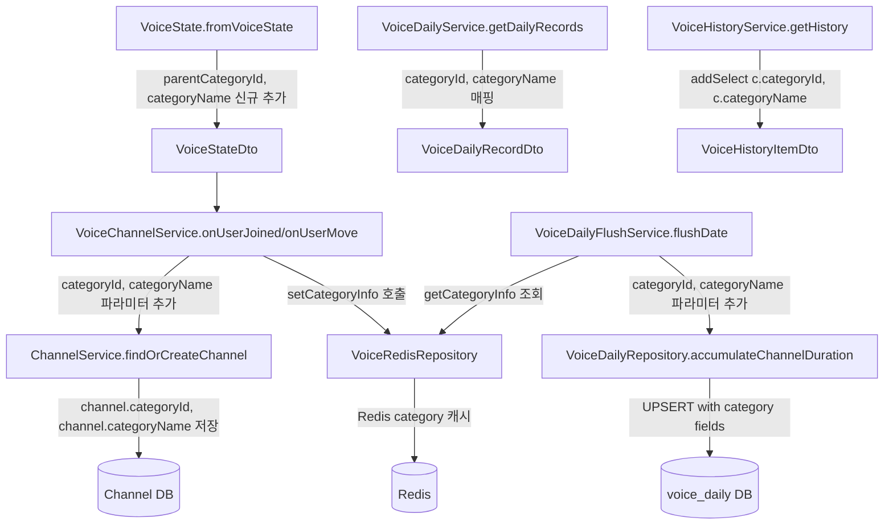

# K-voice-category: 음성기록 카테고리(parentId) 정보 추가

## 개요

디스코드 채널의 카테고리(parentId) 정보를 음성기록 시스템에 추가한다.
Channel 엔티티와 VoiceDailyEntity에 `categoryId`, `categoryName` 컬럼이 이미 추가되어 있으며,
나머지 서비스/DTO/레포지토리 레이어를 일관되게 갱신한다.

## 완료된 작업

| 파일 | 상태 |
|------|------|
| `apps/api/src/channel/channel.entity.ts` | 완료 — `categoryId`, `categoryName` nullable 컬럼 추가됨 |
| `apps/api/src/channel/voice/domain/voice-daily.entity.ts` | 완료 — `categoryId`, `categoryName` nullable 컬럼 추가됨 |
| `apps/api/src/migrations/1774500000000-AddCategoryColumns.ts` | 완료 — 마이그레이션 생성됨 |
| `docs/specs/prd/voice.md` | 완료 — F-VOICE-021 추가됨 |
| `docs/specs/database/_index.md` | 완료 — 스키마 갱신됨 |

## 핵심 설계 결정

### 카테고리명 취득 방식

`VoiceStateDto.fromVoiceState()`에서 `state.channel.parentId`를 이미 수집하고 있다.
Discord.js는 `state.channel.parent` (CategoryChannel)을 캐시에 보유하고 있으며,
`state.channel.parent?.name`으로 별도 API 호출 없이 카테고리명을 얻을 수 있다.

따라서 **`VoiceStateDto`에 `categoryName: string | null` 필드를 추가**하여
`state.channel.parent?.name ?? null`로 채운다.

이렇게 하면 Discord API 추가 호출 없이 카테고리명을 확보할 수 있고,
`ChannelService.findOrCreateChannel()`에 category 정보를 그대로 전달할 수 있다.

### 카테고리 정보 저장 흐름

```
voiceStateUpdate (Discord.js)
    │
    ├─ state.channel.parentId      → VoiceStateDto.parentCategoryId
    └─ state.channel.parent?.name  → VoiceStateDto.categoryName  ← 신규
         │
         ▼
VoiceChannelService.onUserJoined / onUserMove
    │
    ▼
ChannelService.findOrCreateChannel(channelId, channelName, guildId, categoryId, categoryName)
    │  Channel 엔티티에 categoryId, categoryName 저장/갱신
    ▼
VoiceDailyFlushService.flushDate()
    │  channelService.findByDiscordChannelId(channelId) → Channel.categoryId, .categoryName 읽기
    │  (또는 flush 시 직접 Channel 엔티티를 읽어서 전달)
    ▼
VoiceDailyRepository.accumulateChannelDuration(..., categoryId, categoryName)
    │  SQL UPSERT에 categoryId, categoryName 포함
    ▼
voice_daily 테이블 (개별 채널 레코드만 채움, GLOBAL은 null)
```

### flush 시 category 조회 방법

`flushDate()`에서는 현재 `voiceRedisRepository.getChannelName(guild, channelId)`로 채널명을 가져온다.
카테고리 정보도 Redis 캐시에서 가져오는 패턴을 일관되게 적용한다.

- `VoiceRedisRepository`에 `setCategoryInfo` / `getCategoryInfo` 메서드 추가
- `VoiceSessionService.startOrUpdateSession()` 호출 전에 category 캐시를 저장
- `VoiceDailyFlushService.flushDate()`에서 category 정보를 Redis 캐시에서 조회

이 방식이 기존 channelName 캐시 패턴과 일관되며,
flush 시점에 DB 추가 조회 없이 처리 가능하다.

### GLOBAL 레코드

`channelId === 'GLOBAL'`인 레코드의 `categoryId`, `categoryName`은 null로 유지한다.
`accumulateMicDuration`, `accumulateAloneDuration` 메서드는 변경하지 않는다.

## Diagram



## Implementation Plan

### 1. VoiceStateDto — `categoryName` 필드 추가

**파일**: `apps/api/src/channel/voice/infrastructure/voice-state.dto.ts`

현재 `parentCategoryId: string | null`만 있고, 카테고리명은 없다.
`state.channel.parent?.name`은 Discord.js 채널 캐시에서 동기적으로 접근 가능하다.

**변경 내용**:
- 생성자에 `public readonly categoryName: string | null` 파라미터 추가 (8번째 인자, `micOn` 앞)
- `fromVoiceState()` 정적 메서드에서 `state.channel.parent?.name ?? null` 추가

**최종 생성자 시그니처**:
```ts
constructor(
  public readonly guildId: string,
  public readonly userId: string,
  public readonly channelId: string,
  public readonly userName: string,
  public readonly channelName: string,
  public readonly parentCategoryId: string | null,
  public readonly categoryName: string | null,  // 신규
  public readonly micOn: boolean,
  public readonly alone: boolean,
  public readonly channelMemberCount: number,
)
```

**주의**: `fromVoiceState()`가 유일한 생성자 호출부이므로, 기존 테스트나 다른 코드의 직접 생성자 호출 여부를 확인해야 한다.

**충돌 검토**: `VoiceStateDto`를 직접 `new VoiceStateDto(...)`로 호출하는 곳이 있다면 인자 위치가 어긋나므로 모두 수정해야 한다. `fromVoiceState()` 외에 직접 생성하는 곳: `voice-recovery.service.ts` 확인 필요.

---

### 2. VoiceRedisRepository — category 캐시 메서드 추가

**파일**: `apps/api/src/channel/voice/infrastructure/voice-redis.repository.ts`

기존 `setChannelName` / `getChannelName` 패턴과 동일하게 구현한다.
TTL은 `NAME_CACHE`(7일)를 재사용한다.

**추가 메서드**:
```ts
async setCategoryInfo(
  guild: string,
  channelId: string,
  categoryId: string | null,
  categoryName: string | null,
): Promise<void>

async getCategoryInfo(
  guild: string,
  channelId: string,
): Promise<{ categoryId: string | null; categoryName: string | null } | null>
```

**Redis 키 추가** (`voice-cache.keys.ts`):
```ts
categoryInfo: (guild: string, channel: string) => `voice:channel:category:${guild}:${channel}`,
```

**직렬화 방식**: `{ categoryId, categoryName }`을 JSON 문자열로 저장한다.
(기존 channelName은 string 그대로, categoryInfo는 객체라 JSON 사용)

---

### 3. ChannelService — `findOrCreateChannel` category 파라미터 추가

**파일**: `apps/api/src/channel/channel.service.ts`

**변경 내용**:
- 시그니처에 선택 파라미터 `categoryId?: string | null`, `categoryName?: string | null` 추가
- 채널 생성 시: `categoryId`, `categoryName` 포함하여 저장
- 채널 존재 시: `categoryId`가 전달된 경우 갱신 (null 전달도 갱신으로 처리)
  - 단, `categoryId === undefined`이면 갱신하지 않음 (선택 파라미터이므로)

**갱신 조건 설계**:
```ts
// 카테고리 정보가 전달된 경우에만 갱신
const categoryChanged =
  categoryId !== undefined &&
  (channel.categoryId !== categoryId || channel.categoryName !== categoryName);

if (needsUpdate || categoryChanged) {
  // save
}
```

**충돌 검토**: `findOrCreateChannel`은 다음 위치에서 호출됨:
- `voice-channel.service.ts` (onUserJoined, onUserLeave, onUserMove) — 3곳
- `voice-recovery.service.ts` — 확인 필요

`onUserLeave`는 퇴장 시점이므로 category 정보를 전달하지 않는다(기존 값 유지).
`onUserJoined`, `onUserMove`의 newCmd에만 category 파라미터를 전달한다.

---

### 4. VoiceChannelService — category 정보 전달

**파일**: `apps/api/src/channel/voice/application/voice-channel.service.ts`

**변경 내용**:

`onUserJoined`:
```ts
this.channelService.findOrCreateChannel(
  cmd.channelId,
  cmd.channelName,
  cmd.guildId,
  cmd.parentCategoryId,   // 신규
  cmd.categoryName,        // 신규
),
```

`onUserMove`의 newChannel:
```ts
this.channelService.findOrCreateChannel(
  newCmd.channelId,
  newCmd.channelName,
  newCmd.guildId,
  newCmd.parentCategoryId,  // 신규
  newCmd.categoryName,       // 신규
),
```

`onUserLeave`와 `onUserMove`의 oldChannel: category 파라미터 미전달 (undefined로 남겨둠 → 갱신 안 함).

**VoiceRedisRepository.setCategoryInfo 호출 위치**:
`VoiceSessionService.startOrUpdateSession()`에서 `setChannelName`을 호출하는 곳 근처에 추가한다.

---

### 5. VoiceSessionService — category 캐시 저장

**파일**: `apps/api/src/channel/voice/application/voice-session.service.ts`

**변경 내용**:
`startOrUpdateSession()`과 `switchChannel()` 내부에서 `setChannelName` 호출 이후 `setCategoryInfo` 호출 추가.

```ts
// startOrUpdateSession:
await this.voiceRedisRepository.setChannelName(guildId, cmd.channelId, cmd.channelName);
await this.voiceRedisRepository.setCategoryInfo(guildId, cmd.channelId, cmd.parentCategoryId, cmd.categoryName); // 신규
await this.voiceRedisRepository.setUserName(guildId, cmd.userId, cmd.userName);

// switchChannel: newCmd 기준으로도 동일하게 추가
await this.voiceRedisRepository.setChannelName(guildId, newCmd.channelId, newCmd.channelName);
await this.voiceRedisRepository.setCategoryInfo(guildId, newCmd.channelId, newCmd.parentCategoryId, newCmd.categoryName); // 신규
```

---

### 6. VoiceDailyFlushService — category 조회 및 전달

**파일**: `apps/api/src/channel/voice/application/voice-daily-flush-service.ts`

**변경 내용**:
`flushDate()` 내부, 채널별 체류 시간 flush 루프에서 `getChannelName` 호출 옆에 `getCategoryInfo` 추가.

```ts
const channelName =
  (await this.voiceRedisRepository.getChannelName(guild, channelId)) ?? 'UNKNOWN';
const categoryInfo = await this.voiceRedisRepository.getCategoryInfo(guild, channelId); // 신규

await this.voiceDailyRepository.accumulateChannelDuration(
  guild,
  user,
  userName,
  date,
  channelId,
  channelName,
  duration,
  categoryInfo?.categoryId ?? null,    // 신규
  categoryInfo?.categoryName ?? null,  // 신규
);
```

---

### 7. VoiceDailyRepository — SQL UPSERT에 category 필드 추가

**파일**: `apps/api/src/channel/voice/infrastructure/voice-daily.repository.ts`

**변경 내용**:
`accumulateChannelDuration` 시그니처에 `categoryId: string | null`, `categoryName: string | null` 추가.
SQL UPSERT에 `"categoryId"`, `"categoryName"` 컬럼 포함.

```ts
async accumulateChannelDuration(
  guildId: string,
  userId: string,
  userName: string,
  date: string,
  channelId: string,
  channelName: string,
  durationSec: number,
  categoryId: string | null,    // 신규
  categoryName: string | null,  // 신규
): Promise<void> {
  await this.repo.query(
    `
    INSERT INTO voice_daily AS vd
        ("guildId","userId","userName","date","channelId","channelName","channelDurationSec","categoryId","categoryName")
    VALUES ($1,$2,$3,$4,$5,$6,$7,$8,$9)
    ON CONFLICT ("guildId","userId","date","channelId")
    DO UPDATE SET
      "channelDurationSec" =
      vd."channelDurationSec" + EXCLUDED."channelDurationSec",
      "channelName" = EXCLUDED."channelName",
      "userName"    = EXCLUDED."userName",
      "categoryId"   = COALESCE(EXCLUDED."categoryId", vd."categoryId"),
      "categoryName" = COALESCE(EXCLUDED."categoryName", vd."categoryName")
    `,
    [guildId, userId, userName, date, channelId, channelName, durationSec, categoryId, categoryName],
  );
}
```

**ON CONFLICT DO UPDATE 처리 방식**:
- `COALESCE(EXCLUDED."categoryId", vd."categoryId")` — 새로 들어온 값이 null이면 기존 값 유지. 이미 카테고리가 있는 기존 레코드에도 점진적으로 채울 수 있다.

---

### 8. VoiceDailyRecordDto — category 필드 추가

**파일**: `apps/api/src/channel/voice/dto/voice-daily-record.dto.ts`

**변경 내용**:
```ts
export class VoiceDailyRecordDto {
  guildId: string;
  userId: string;
  userName: string;
  date: string;
  channelId: string;
  channelName: string;
  categoryId: string | null;    // 신규
  categoryName: string | null;  // 신규
  channelDurationSec: number;
  micOnSec: number;
  micOffSec: number;
  aloneSec: number;
}
```

---

### 9. VoiceDailyService — DTO 매핑에 category 필드 추가

**파일**: `apps/api/src/channel/voice/application/voice-daily.service.ts`

**변경 내용**:
`getDailyRecords()`의 `.map()` 블록에 `categoryId`, `categoryName` 추가.

```ts
return entities.map((e) => ({
  guildId: e.guildId,
  userId: e.userId,
  userName: e.userName,
  date: e.date,
  channelId: e.channelId,
  channelName: e.channelName,
  categoryId: e.categoryId ?? null,    // 신규
  categoryName: e.categoryName ?? null, // 신규
  channelDurationSec: e.channelDurationSec,
  micOnSec: e.micOnSec,
  micOffSec: e.micOffSec,
  aloneSec: e.aloneSec,
}));
```

---

### 10. VoiceHistoryService — category 필드 select 및 매핑

**파일**: `apps/api/src/channel/voice/application/voice-history.service.ts`

현재 `addSelect(['m.discordMemberId', 'c.discordChannelId', 'c.channelName'])`로 채널명만 선택.
`c.categoryId`, `c.categoryName`도 추가해야 한다.

**변경 내용**:
```ts
.addSelect(['m.discordMemberId', 'c.discordChannelId', 'c.channelName', 'c.categoryId', 'c.categoryName'])
```

`toItemDto()`:
```ts
private toItemDto(h: VoiceChannelHistory): VoiceHistoryItemDto {
  return {
    id: h.id,
    channelId: h.channel.discordChannelId,
    channelName: h.channel.channelName,
    categoryId: h.channel.categoryId ?? null,    // 신규
    categoryName: h.channel.categoryName ?? null, // 신규
    joinAt: h.joinedAt.toISOString(),
    leftAt: h.leftAt ? h.leftAt.toISOString() : null,
    durationSec: h.duration,
  };
}
```

---

### 11. VoiceHistoryItemDto — category 필드 추가

**파일**: `apps/api/src/channel/voice/dto/voice-history-page.dto.ts`

```ts
export class VoiceHistoryItemDto {
  id: number;
  channelId: string;
  channelName: string;
  categoryId: string | null;    // 신규
  categoryName: string | null;  // 신규
  joinAt: string;
  leftAt: string | null;
  durationSec: number | null;
}
```

---

### 12. 프론트엔드 타입 갱신

**파일**: `apps/web/app/lib/voice-dashboard-api.ts`

`VoiceDailyRecord` 인터페이스에 추가:
```ts
categoryId: string | null;
categoryName: string | null;
```

**파일**: `apps/web/app/lib/user-detail-api.ts`

`VoiceHistoryItem` 인터페이스에 추가:
```ts
categoryId: string | null;
categoryName: string | null;
```

프론트엔드 컴포넌트에서 이 필드를 직접 사용하는 코드는 현재 없으므로 타입 추가만으로 충분하다.

---

### voice-recovery.service.ts 충돌 없음 (확인 완료)

`voice-recovery.service.ts`는 `VoiceStateDto`를 직접 생성하지 않는다.
`flushDate(guildId, userId, session.date)`만 호출하므로 이번 변경과 충돌하지 않는다.

---

## 변경 파일 목록 (구현 순서)

| 순서 | 파일 | 변경 유형 |
|------|------|-----------|
| 1 | `apps/api/src/channel/voice/infrastructure/voice-cache.keys.ts` | 키 추가 |
| 2 | `apps/api/src/channel/voice/infrastructure/voice-state.dto.ts` | 필드 추가 |
| 3 | `apps/api/src/channel/voice/infrastructure/voice-redis.repository.ts` | 메서드 추가 |
| 4 | `apps/api/src/channel/channel.service.ts` | 파라미터 추가 |
| 5 | `apps/api/src/channel/voice/application/voice-session.service.ts` | 캐시 저장 추가 |
| 6 | `apps/api/src/channel/voice/application/voice-channel.service.ts` | 파라미터 전달 추가 |
| 7 | `apps/api/src/channel/voice/application/voice-recovery.service.ts` | 수정 불필요 (충돌 없음) |
| 8 | `apps/api/src/channel/voice/infrastructure/voice-daily.repository.ts` | SQL + 시그니처 수정 |
| 9 | `apps/api/src/channel/voice/application/voice-daily-flush-service.ts` | category 조회 및 전달 |
| 10 | `apps/api/src/channel/voice/dto/voice-daily-record.dto.ts` | 필드 추가 |
| 11 | `apps/api/src/channel/voice/application/voice-daily.service.ts` | 매핑 추가 |
| 12 | `apps/api/src/channel/voice/dto/voice-history-page.dto.ts` | 필드 추가 |
| 13 | `apps/api/src/channel/voice/application/voice-history.service.ts` | select + 매핑 추가 |
| 14 | `apps/web/app/lib/voice-dashboard-api.ts` | 인터페이스 필드 추가 |
| 15 | `apps/web/app/lib/user-detail-api.ts` | 인터페이스 필드 추가 |

## 기존 코드 충돌 검토

| 항목 | 결론 |
|------|------|
| `VoiceStateDto` 생성자 인자 순서 변경 | `fromVoiceState()` 외 직접 생성 호출부 없음 확인 — `voice-recovery.service.ts`는 `VoiceStateDto` 미사용 |
| `findOrCreateChannel` 시그니처 변경 | 선택 파라미터 추가이므로 기존 호출부 `onUserLeave` 등은 변경 불필요 |
| `accumulateChannelDuration` 시그니처 변경 | 호출부는 `voice-daily-flush-service.ts` 하나뿐이므로 동시 수정 |
| SQL UPSERT `COALESCE` 전략 | 기존 null 레코드에도 나중에 category가 채워지는 점진적 갱신 허용, PRD와 일치 |
| category Redis 캐시 누락 시 | `null`로 처리 — DB에도 null, non-blocking 보장 |
| `VoiceHistoryService` addSelect 누락 | 현재 `c.categoryId`, `c.categoryName`을 select하지 않아 ORM이 `undefined` 반환할 것 — 반드시 추가 필요 |
