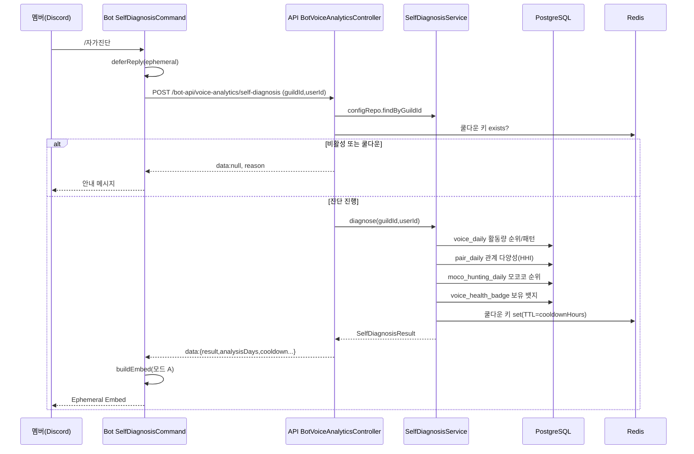

# 유스케이스 ID: UC-SD-01

### 제목
멤버가 `/자가진단` 슬래시 커맨드로 음성 활동 건강도를 정량 진단받는다 (bot → api → Discord embed)

---

## 1. 개요

### 1.1 목적
디스코드 서버 멤버가 본인의 음성 활동 건강도(활동량 · 관계 다양성 · 모코코 기여 · 참여 패턴)를 서버 내 순위/백분위와 함께 정량 진단받고, 길드 정책 기준 대비 충족 여부와 보유/미달성 뱃지를 한 번에 확인하는 cross-app 통합 흐름을 검증한다.

### 1.2 범위
- 포함: `/자가진단` 슬래시 커맨드(bot) → API 진단 엔드포인트 호출 → 4개 도메인 데이터 집계(voice / co-presence / moco / config) → HHI·순위·백분위 계산 → 정책 판정 → 뱃지 조회 → Ephemeral Embed 렌더링
- 제외: 정책 설정 변경(UC-SD-02), 뱃지 배치 산정 스케줄러(UC-SD-03), AI 종합 진단 모드(UC-SD-04), 서버 전체 주간 리포트(gemini 도메인 소관)

### 1.3 액터
- **주요 액터**: 서버 멤버 (디스코드 사용자)
- **부 액터**:
  - Bot 프로세스 (`SelfDiagnosisCommand`, `@onyu/bot-api-client`)
  - API 서버 (`BotVoiceAnalyticsController` → `SelfDiagnosisService`)
  - PostgreSQL (`voice_daily`, `voice_co_presence_pair_daily`, `moco_hunting_daily`, `voice_health_config`, `voice_health_badge`)
  - Redis (쿨다운 키, 진단 결과 캐시)

---

## 2. 선행 조건

- 멤버가 서버에 소속되어 있고 `/자가진단` 커맨드가 길드에 등록되어 있다.
- 관리자가 웹 대시보드에서 자가진단 기능을 활성화(`isEnabled=true`)했다 (UC-SD-02 선행).
- 진단 대상 멤버에게 최근 분석 기간(`analysisDays`) 내 음성 활동 기록이 존재한다.
- 쿨다운이 활성화된 경우, 직전 진단 후 쿨다운 시간이 경과했다.

---

## 3. 참여 컴포넌트

- **Discord 클라이언트**: `/자가진단` 슬래시 커맨드 입력, Ephemeral 응답 표시
- **Bot — `SelfDiagnosisCommand`**: 커맨드 핸들러. `deferReply(ephemeral)` → API 호출 → Embed 빌드
- **Bot API 클라이언트 — `@onyu/bot-api-client`**: `runSelfDiagnosis(guildId, userId)` 호출
- **API — `BotVoiceAnalyticsController`** (`POST /bot-api/voice-analytics/self-diagnosis`): 설정/쿨다운 1차 확인 후 서비스 위임
- **API — `SelfDiagnosisService.diagnose()`**: 데이터 집계 + 순위/HHI/판정/뱃지 조립 엔진
- **API — `VoiceHealthConfigRepository`**: 길드 정책 조회 (Redis 캐시 + DB)
- **API — `BadgeQueryService`**: 보유 뱃지 코드 조회
- **DB**: `voice_daily`(활동량·참여 패턴), `voice_co_presence_pair_daily`(관계 다양성), `moco_hunting_daily`(모코코 기여), `voice_health_config`(정책), `voice_health_badge`(보유 뱃지)
- **Redis**: 쿨다운 키 `voice-health:cooldown:{guildId}:{userId}`

---

## 4. 기본 플로우 (Basic Flow)

### 4.1 단계별 흐름

1. **멤버**: 서버 텍스트 채널에서 `/자가진단` 입력
   - 입력: guildId, userId (interaction 컨텍스트)
   - 처리: Bot이 `deferReply({ ephemeral: true })`로 응답 지연 (집계 시간 확보)

2. **Bot (`SelfDiagnosisCommand`)**: `apiClient.runSelfDiagnosis(guildId, userId)` 호출
   - guildId 부재 시 "서버에서만 사용 가능한 명령어입니다." 안내 후 종료

3. **API (`BotVoiceAnalyticsController`)**: 정책 조회 + 쿨다운 1차 확인
   - 설정 없음/비활성 → `{ data: null, reason: 'not_enabled' }`
   - 쿨다운 키 존재 → `{ data: null, reason: 'cooldown', remainingSeconds }`

4. **API (`SelfDiagnosisService.diagnose()`)**: 분석 기간(KST, `analysisDays`) 날짜 범위 산출 후 4개 영역 집계
   - **활동량**: `voice_daily`에서 개별 채널(`channelId != 'GLOBAL'`) `SUM(channelDurationSec)` 기준 전체 사용자 순위 산출 → 본인 총시간/활동일/순위/백분위
   - **관계 다양성**: `voice_co_presence_pair_daily`를 단방향 저장(userId<peerId) 양방향 조회 후 peer별 합산 → HHI 계산 + 상위 3명(peer 이름은 `voice_daily.userName`으로 해소)
   - **모코코 기여**: `moco_hunting_daily`에서 `SUM(score)` 순위 + 도운 신입(연인원)
   - **참여 패턴**: `voice_daily` GLOBAL의 `micOnSec`/`aloneSec`을 개별 채널 총 `channelDurationSec`로 나눈 마이크 사용률·혼자 비율

5. **API**: 정책 판정(`verdicts`) 조립 — 활동량/활동 일수/관계 다양성/교류 인원 4개 카테고리에 대해 `isPassed`, `criterion`, `actual` 생성 (HHI는 표시 시 `다양성 점수 = (1 - HHI) × 100`으로 변환)

6. **API (`BadgeQueryService`)**: `voice_health_badge`에서 보유 뱃지 코드 조회 → 5개 뱃지 달성 가이드(`badgeGuides`) 조립 (보유 여부 + 기준 + 현재값)

7. **API**: 쿨다운 활성 시 Redis에 쿨다운 키 설정(TTL=`cooldownHours`), `SelfDiagnosisResult` 반환

8. **Bot (`SelfDiagnosisCommand.buildEmbed()`)**: 모드 A(상세 데이터) Embed 렌더링
   - 활동량 / 관계 다양성(다양성 점수) / 모코코 기여 / 참여 패턴 / 획득 뱃지 / 뱃지 가이드 섹션
   - Footer: 분석 기간 + 다음 진단 가능 시각 (쿨다운 비활성 시 "제한 없음")

9. **멤버**: 본인에게만 보이는 Ephemeral Embed 확인

### 4.2 시퀀스 다이어그램

---

## 5. 대안 플로우 (Alternative Flows)

### 5.1 대안 플로우 1: AI 요약 모드 (`isLlmSummaryEnabled=true`)
**시작 조건**: 길드 정책이 AI 종합 진단을 켠 경우.
**단계**: 진단 결과를 Redis에 캐싱한 뒤, Bot이 2차로 LLM 요약을 요청한다. 상세 플로우는 **UC-SD-04**에서 명세한다.
**결과**: 모드 B Embed(AI 요약 + 뱃지 섹션만) 렌더링.

### 5.2 대안 플로우 2: Co-Presence 데이터 부족
**시작 조건**: 분석 기간 내 동시접속 쌍 데이터(`voice_co_presence_pair_daily`)가 없음.
**단계**: HHI는 0, 교류 인원 0으로 산출되고, Embed의 관계 다양성 섹션은 다양성 점수/교류 인원만 표시(주요 교류 멤버 줄 생략).
**결과**: 관계 다양성 판정은 미달 가능성이 있으나 진단은 정상 완료.

### 5.3 대안 플로우 3: 모코코 미참여
**시작 조건**: 본인이 모코코 사냥 기록 없음(`hasMocoActivity=false`).
**단계**: 모코코 섹션에 "아직 모코코 활동이 없습니다 + 참여 권유 + 현재 참여자 수" 표시. 서버 전체 모코코 데이터도 없으면 "서버에 모코코 데이터가 없습니다."
**결과**: HUNTER 뱃지 가이드의 현재값은 "기록 없음".

---

## 6. 예외 플로우 (Exception Flows)

### 6.1 예외 상황 1: 기능 비활성화
**발생 조건**: 길드 정책이 없거나 `isEnabled=false`.
**처리**: API가 `reason: 'not_enabled'` 반환 → Bot이 안내 메시지 표시.
**사용자 메시지**: "이 서버에서는 자가진단 기능이 활성화되지 않았습니다."

### 6.2 예외 상황 2: 쿨다운 중
**발생 조건**: Redis 쿨다운 키 존재 (`isCooldownEnabled=true`).
**처리**: API가 `reason: 'cooldown'` + 남은 초 반환 → Bot이 남은 시간 포맷팅 후 안내.
**사용자 메시지**: "쿨다운 중입니다. {남은시간} 후에 다시 시도해주세요."

### 6.3 예외 상황 3: 활동 데이터 없음
**발생 조건**: 진단은 성공했으나 `result.totalMinutes === 0`.
**처리**: Bot이 Embed 대신 안내 메시지 표시.
**사용자 메시지**: "최근 {N}일간 음성 채널 활동 기록이 없습니다."

### 6.4 예외 상황 4: API/네트워크 오류
**발생 조건**: API 호출 실패 또는 예기치 못한 예외.
**처리**: Bot이 로그 기록 후 일반 오류 안내.
**사용자 메시지**: "자가진단 중 오류가 발생했습니다."

---

## 7. 후행 조건 (Post-conditions)

### 7.1 성공 시
- **데이터베이스 변경**: 없음 (읽기 전용 집계). `voice_daily` / `pair_daily` / `moco_hunting_daily` / `voice_health_config` / `voice_health_badge` 모두 read-only 소비.
- **시스템 상태**: 쿨다운 활성 시 Redis에 쿨다운 키가 TTL과 함께 설정됨. AI 모드 시 진단 결과가 Redis에 캐싱됨.
- **외부 시스템**: 멤버에게 Ephemeral Embed 전달.

### 7.2 실패 시
- **데이터 롤백**: 없음 (DB 쓰기 없음).
- **시스템 상태**: 쿨다운 설정 전 단계에서 실패하면 쿨다운 미적용 → 재시도 가능.

---

## 8. 비기능 요구사항

### 8.1 성능
- `deferReply`로 3초 응답 제약 회피. 4개 영역 집계는 가능한 병렬(`Promise.all`)로 수행.
- 관계 다양성/참여 패턴 조회는 인덱스(`IDX_voice_daily_guild_user_date`, `IDX_voice_co_presence_pair_daily_*`) 활용.

### 8.2 보안
- Bot→API 호출은 `BotApiAuthGuard`로 보호.
- 응답은 Ephemeral — 본인만 열람. 타인 데이터 노출 없음(본인 userId만 조회).
- 🔒 **PII**: 주요 교류 멤버 이름(top peers)이 본인에게만 노출됨. 양측 익명화 정책(주간 리포트의 privacy filter)과 달리 본인 진단은 본인 시점이므로 peer 이름 표시는 허용. 단, peer 본인이 자신 데이터를 보는 것이 아니라는 점에서 사생활 정책 변경 시 재검토 필요.

### 8.3 가용성
- Co-Presence/모코코 데이터 부재는 진단을 막지 않고 부분 표시로 graceful degradation.

---

## 9. UI/UX 요구사항

### 9.1 화면 구성 (모드 A — 상세 데이터)
- Title `🩺 음성 활동 자가진단`, Color Blurple(`#5B8DEF`)
- 섹션: 📊 활동량 / 🤝 관계 다양성 / 🌱 모코코 기여 / 🔍 참여 패턴 / 🏅 획득한 뱃지 / 📖 뱃지 가이드
- 판정 이모지: 충족 ✅ / 미달 ⚠️

### 9.2 사용자 경험
- 다양성은 HHI 원본이 아닌 "다양성 점수(0~100, 높을수록 좋음)"로 직관 표시.
- Footer에 분석 기간과 다음 진단 가능 시각을 명시해 재실행 시점 예측 가능.

---

## 10. 테스트 시나리오

### 10.1 성공 케이스

| 테스트 케이스 ID | 입력값 | 기대 결과 |
|----------------|--------|----------|
| TC-SD-01-01 | 활성 길드 + 활동 풍부한 멤버 | 4개 섹션 + 뱃지 섹션이 채워진 Embed |
| TC-SD-01-02 | Co-Presence 데이터 없는 멤버 | 관계 다양성 섹션이 점수/인원만 표시(교류 멤버 줄 생략) |
| TC-SD-01-03 | 모코코 미참여 멤버 | 모코코 섹션이 참여 권유 안내로 표시, HUNTER 가이드 "기록 없음" |
| TC-SD-01-04 | 쿨다운 비활성 길드 | Footer 다음 진단 "제한 없음" |

### 10.2 실패 케이스

| 테스트 케이스 ID | 입력값 | 기대 결과 |
|----------------|--------|----------|
| TC-SD-01-05 | 비활성 길드 | "자가진단 기능이 활성화되지 않았습니다." |
| TC-SD-01-06 | 쿨다운 중 | "쿨다운 중입니다. {시간} 후..." |
| TC-SD-01-07 | 활동 기록 0 | "최근 {N}일간 음성 채널 활동 기록이 없습니다." |
| TC-SD-01-08 | DM에서 실행(guildId 없음) | "서버에서만 사용 가능한 명령어입니다." |

---

## 11. 관련 유스케이스

- **선행 유스케이스**: UC-SD-02 (정책 설정 — 기능 활성화/기준값 제공)
- **연관 유스케이스**: UC-SD-03 (뱃지 배치 산정 — 보유 뱃지 데이터 제공), UC-SD-04 (AI 요약 모드)

---

## 12. 변경 이력

| 버전 | 날짜 | 작성자 | 변경 내용 |
|------|------|--------|-----------|
| 1.0 | 2026-05-20 | usecase-writer | 초기 작성 |

---

## 부록

### A. 용어 정의
- **HHI (Herfindahl-Hirschman Index)**: peer별 동시접속 시간 점유율 제곱의 합. 0(완전 분산)~1(한 명 집중). 낮을수록 관계가 다양.
- **다양성 점수**: 표시 레이어 변환값 `(1 - HHI) × 100`. 0~100, 높을수록 좋음.
- **백분위(상위 N%)**: `(순위 / 전체 인원) × 100`.

### B. 참고 자료
- PRD: `/docs/specs/prd/self-diagnosis.md` (F-SD-004, F-SD-005)
- 코드: bot `apps/bot/src/command/voice-analytics/self-diagnosis.command.ts`, api `apps/api/src/bot-api/voice-analytics/bot-voice-analytics.controller.ts`, `apps/api/src/voice-analytics/self-diagnosis/application/self-diagnosis.service.ts`
