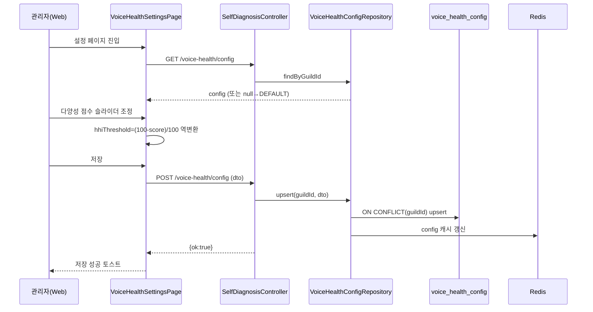

# 유스케이스 ID: UC-SD-02

### 제목
관리자가 웹 대시보드에서 자가진단 정책·뱃지 기준을 설정하면 진단/뱃지 판정에 반영된다 (web → api → DB/Redis)

---

## 1. 개요

### 1.1 목적
관리자가 길드별 자가진단 정책(활성화 · 분석 기간 · 쿨다운 · AI 요약)과 정책/뱃지 판정 기준을 웹 대시보드에서 설정하고, 이 설정이 멤버의 `/자가진단`(UC-SD-01)과 뱃지 배치 산정(UC-SD-03)에 일관되게 반영되는 cross-app 통합 흐름을 검증한다.

### 1.2 범위
- 포함: 웹 설정 페이지(web) → 정책 조회/저장 API(api) → `voice_health_config` upsert + Redis 캐시 → 진단/뱃지 로직 소비
- 포함: 다양성 점수 ↔ HHI 역변환(UI ↔ DB) 정합성
- 제외: 진단 실행 흐름(UC-SD-01), 뱃지 배치 산정 내부 로직(UC-SD-03)

### 1.3 액터
- **주요 액터**: 서버 관리자 (웹 대시보드 로그인 사용자)
- **부 액터**:
  - Web (`/settings/guild/[guildId]/voice-health` page, `voice-health-api.ts`)
  - API (`SelfDiagnosisController` `api/guilds/:guildId/voice-health`)
  - `VoiceHealthConfigRepository` (Redis 캐시 + DB)
  - DB `voice_health_config`

---

## 2. 선행 조건

- 관리자가 웹에 로그인되어 있고(`JwtAuthGuard`) 대상 길드 관리 권한을 보유한다.
- 대시보드 사이드바에서 길드(`selectedGuildId`)가 선택되어 있다.

---

## 3. 참여 컴포넌트

- **Web 페이지 `VoiceHealthSettingsPage`**: 기본 설정/정책 기준/뱃지 기준 3개 섹션 폼, 토글/숫자/슬라이더/프리셋 UI
- **Web API 모듈 `voice-health-api.ts`**: `fetchVoiceHealthConfig` / `saveVoiceHealthConfig`
- **API `SelfDiagnosisController`** (`JwtAuthGuard`):
  - `GET /api/guilds/:guildId/voice-health/config` — 조회
  - `POST /api/guilds/:guildId/voice-health/config` — upsert
  - `POST /api/guilds/:guildId/voice-health/recalc-badges` — 뱃지 수동 재계산(선택)
- **`VoiceHealthConfigRepository`**: Redis 캐시 + DB upsert
- **DB `voice_health_config`**: `UNIQUE(guildId)`. 정책/임계값 컬럼 일체

---

## 4. 기본 플로우 (Basic Flow)

### 4.1 단계별 흐름

1. **관리자**: 설정 페이지 진입
   - 처리: Web이 `fetchVoiceHealthConfig(guildId)`로 기존 정책 조회 → 폼에 채움. 없으면 `DEFAULT_CONFIG` 사용
   - 변환: DB의 decimal 필드(`minActiveDaysRatio`, `hhiThreshold`, `badgeSocialHhiMax`, `badgeConsistentMinRatio`, `badgeMicMinRate`)를 `Number()`로 정규화

2. **관리자**: 정책 값 조정
   - 기본: 기능 활성화 토글, 분석 기간(7~90), 쿨다운 토글/시간(1~168), AI 요약 토글
   - 정책 기준: 최소 활동시간(분), 최소 활동일 비율(슬라이더 %), **관계 다양성 점수 슬라이더**, 최소 교류 인원
   - 뱃지 기준: 활동왕 상위%, 사교왕 다양성 점수 슬라이더+최소 인원, 헌터 상위%, 꾸준러 비율, 소통러 비율

3. **Web (UI ↔ DB 변환)**: 다양성 점수 → HHI 역변환
   - 정책 다양성 점수 → `hhiThreshold = (100 - score) / 100`
   - 사교왕 다양성 점수 → `badgeSocialHhiMax = (100 - score) / 100`
   - 프리셋 버튼: 느슨(50점/HHI 0.50/2명), 보통(70점/0.30/3명), 엄격(80점/0.20/5명) — `hhiThreshold`+`minPeerCount` 원자적 동시 갱신

4. **관리자**: 저장 클릭 → `saveVoiceHealthConfig(guildId, form)`

5. **API (`SelfDiagnosisController.saveConfig`)**: DTO 검증 후 `configRepo.upsert(guildId, dto)`
   - DB `voice_health_config`에 `ON CONFLICT(guildId)` upsert
   - Redis 캐시 무효화/갱신 (`voice-health:config:{guildId}`)
   - `{ ok: true }` 반환

6. **Web**: 저장 성공 토스트 표시(3초). 실패 시 에러 메시지.

7. **(반영 검증)**: 이후 `/자가진단`(UC-SD-01)과 뱃지 스케줄러(UC-SD-03)가 `configRepo.findByGuildId`로 갱신된 정책을 읽어 판정 기준에 적용.

### 4.2 시퀀스 다이어그램

---

## 5. 대안 플로우 (Alternative Flows)

### 5.1 대안 플로우 1: 정책이 없는 신규 길드
**시작 조건**: `GET config`가 null 반환.
**단계**: Web이 `DEFAULT_CONFIG`(분석 30일/쿨다운 24h/HHI 0.30 등)로 폼 초기화. 저장 시 첫 레코드 insert.
**결과**: 최초 정책 생성.

### 5.2 대안 플로우 2: 뱃지 수동 재계산
**시작 조건**: 관리자가 기준 변경 후 즉시 반영을 원함(스케줄러 대기 없이).
**단계**: `POST /voice-health/recalc-badges` 호출 → `badgeService.judgeAll(config)` 동기 실행 → 처리 건수 반환.
**결과**: `voice_health_badge`가 즉시 갱신됨. 비활성 길드면 `{ ok: false, processed: 0 }`.

---

## 6. 예외 플로우 (Exception Flows)

### 6.1 예외 상황 1: 미인증/권한 없음
**발생 조건**: JWT 없음 또는 길드 관리 권한 없음.
**처리**: `JwtAuthGuard`가 401/403 반환.
**사용자 메시지**: 로그인/권한 안내.

### 6.2 예외 상황 2: 입력값 범위 위반
**발생 조건**: 분석 기간 7~90 외, 쿨다운 1~168 외, 비율/상위% 범위 외 등.
**처리**: Web input min/max + DTO 검증으로 거부.
**사용자 메시지**: 저장 실패 토스트 (`common.saveError`).

### 6.3 예외 상황 3: 저장 중 서버 오류
**발생 조건**: upsert 또는 캐시 갱신 실패.
**처리**: API 5xx → Web이 에러 메시지 표시. 폼 상태 유지(재시도 가능).

---

## 7. 후행 조건 (Post-conditions)

### 7.1 성공 시
- **데이터베이스 변경**: `voice_health_config` 1행 upsert (guildId UNIQUE).
- **시스템 상태**: Redis 정책 캐시 갱신. 이후 진단/뱃지 판정이 새 기준 적용.
- **외부 시스템**: 없음 (Discord 발송 없음).

### 7.2 실패 시
- **데이터 롤백**: upsert 트랜잭션 실패 시 DB 미변경. 폼 입력값은 클라이언트에 유지.

---

## 8. 비기능 요구사항

### 8.1 성능
- 정책 조회는 Redis 캐시 우선(TTL 1시간), miss 시 DB 조회.

### 8.2 보안
- 모든 엔드포인트 `JwtAuthGuard` + 길드 관리 권한.
- 🔒 **권한**: 정책 변경은 서버 관리자만 가능해야 함. 권한 검증 누락 시 타 길드 정책 변조 위험 — guildId 스코프 권한 확인 필수.

### 8.3 가용성
- 캐시 갱신 실패가 저장 성공을 무효화하지 않도록 DB가 진실의 소스.

---

## 9. UI/UX 요구사항

### 9.1 화면 구성
- 3개 섹션(기본/정책 기준/뱃지 기준), 슬라이더는 점수(0~100) 단위로 표시하되 내부 저장은 HHI/비율.
- 쿨다운 시간 입력은 쿨다운 활성 시에만 노출.
- 다양성 프리셋 3버튼(느슨/보통/엄격)으로 빠른 설정.

### 9.2 사용자 경험
- 저장 성공/실패 즉시 토스트 피드백.
- 다양성 슬라이더는 "점수가 높을수록 다양"이라는 직관 유지(HHI 역방향 노출 안 함).

---

## 10. 테스트 시나리오

### 10.1 성공 케이스

| 테스트 케이스 ID | 입력값 | 기대 결과 |
|----------------|--------|----------|
| TC-SD-02-01 | 신규 길드 기본값 저장 | `voice_health_config` insert, 토스트 성공 |
| TC-SD-02-02 | 다양성 점수 80 저장 | DB `hhiThreshold=0.20` 저장(역변환 정합) |
| TC-SD-02-03 | "엄격" 프리셋 클릭 후 저장 | `hhiThreshold=0.20`, `minPeerCount=5` 동시 저장 |
| TC-SD-02-04 | recalc-badges 호출(활성) | `voice_health_badge` 갱신 + processed>0 |

### 10.2 실패 케이스

| 테스트 케이스 ID | 입력값 | 기대 결과 |
|----------------|--------|----------|
| TC-SD-02-05 | 분석 기간 100 | 범위 위반으로 저장 거부 |
| TC-SD-02-06 | 미인증 요청 | 401/403 |
| TC-SD-02-07 | recalc-badges 호출(비활성 길드) | `{ ok:false, processed:0 }` |

---

## 11. 관련 유스케이스

- **후행 유스케이스**: UC-SD-01 (진단 실행 — 정책 소비), UC-SD-03 (뱃지 배치 산정 — 임계값 소비)
- **연관 유스케이스**: UC-SD-04 (AI 요약 — `isLlmSummaryEnabled` 토글 효과)

---

## 12. 변경 이력

| 버전 | 날짜 | 작성자 | 변경 내용 |
|------|------|--------|-----------|
| 1.0 | 2026-05-20 | usecase-writer | 초기 작성 |

---

## 부록

### A. 용어 정의
- **다양성 점수 역변환**: UI 점수 → DB HHI = `(100 - score) / 100`. DB는 HHI 원본(0~1) 저장.
- **프리셋**: 느슨/보통/엄격 — 다양성 점수 + 최소 교류 인원 조합.

### B. 참고 자료
- PRD: `/docs/specs/prd/self-diagnosis.md` (F-SD-003, F-SD-008)
- 코드: web `apps/web/app/settings/guild/[guildId]/voice-health/page.tsx`, `apps/web/app/lib/voice-health-api.ts`; api `apps/api/src/voice-analytics/self-diagnosis/presentation/self-diagnosis.controller.ts`, `.../infrastructure/voice-health-config.repository.ts`
- DB: `/docs/specs/database/_index.md` (`voice_health_config`)
