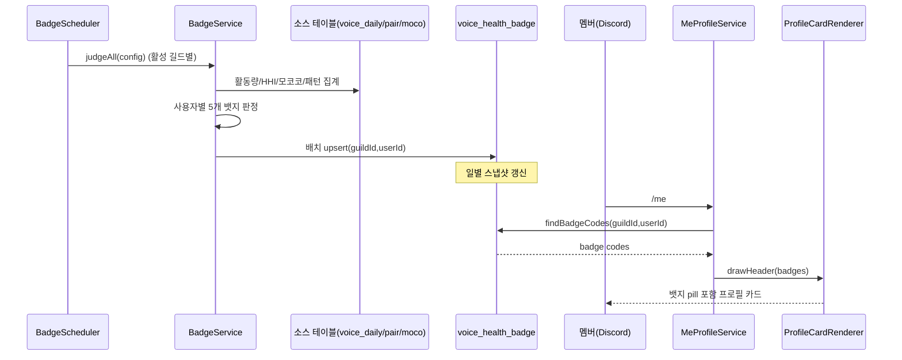

# 유스케이스 ID: UC-SD-03

### 제목
배지 스케줄러가 전체 멤버 뱃지를 배치 산정하고, `/me` 프로필 카드와 `/자가진단`에 반영한다 (api scheduler → DB → bot /me 카드)

---

## 1. 개요

### 1.1 목적
주기 스케줄러가 활성 길드 전체 멤버의 뱃지 자격(활동왕/사교왕/헌터/꾸준러/소통러)을 배치 판정하여 `voice_health_badge`에 저장하고, 이 결과가 `/me` 프로필 카드 헤더의 뱃지 pill과 `/자가진단`의 "획득한 뱃지" 섹션에 일관되게 표시되는 cross-app 통합 흐름을 검증한다.

### 1.2 범위
- 포함: `BadgeScheduler`(주기/부팅 트리거) → `BadgeService.judgeAll()` 배치 판정 → `voice_health_badge` upsert → `BadgeQueryService` 조회 → `/me` 프로필 카드 pill 렌더링(`MeProfileService`/`ProfileCardRenderer`)
- 포함: 진단(UC-SD-01)의 보유 뱃지 표시와의 데이터 일관성
- 제외: 진단 실행 흐름 전체(UC-SD-01), 정책 설정(UC-SD-02)

### 1.3 액터
- **주요 액터**: 시스템 스케줄러 (`BadgeScheduler` Cron / 부팅 시 1회)
- **부 액터**:
  - `BadgeService` (배치 판정 엔진)
  - DB `voice_health_badge`, 소스 테이블 `voice_daily`/`voice_co_presence_pair_daily`/`moco_hunting_daily`
  - `BadgeQueryService` (보유 뱃지 조회 — 진단·/me 공용)
  - Bot `/me` 커맨드 → API `MeProfileService` → `ProfileCardRenderer`
  - 멤버 (`/me` 또는 `/자가진단`로 결과 열람)

---

## 2. 선행 조건

- 길드 정책이 활성(`isEnabled=true`)이며 임계값이 설정되어 있다 (UC-SD-02 선행).
- 소스 데이터(`voice_daily`, `voice_co_presence_pair_daily`, `moco_hunting_daily`)에 분석 기간 내 레코드가 존재한다.

---

## 3. 참여 컴포넌트

- **`BadgeScheduler`**: `@Cron('30 * * * *', Asia/Seoul)` 매시 30분 실행 + `onApplicationBootstrap` 부팅 시 1회. 활성 길드 순회.
- **`BadgeService.judgeAll(config)`**:
  - 활동량 순위(개별 채널 `SUM(channelDurationSec)`), HHI(pair_daily 양방향 전개), 모코코 순위, 참여 패턴(GLOBAL mic/alone) 일괄 산출
  - 사용자별 5개 뱃지 판정 → 100건 단위 배치 upsert
- **DB `voice_health_badge`**: `UNIQUE(guildId, userId)`, `badges` JSON + 지표 스냅샷
- **`BadgeQueryService.findBadgeCodes`**: 보유 뱃지 코드 조회 (UC-SD-01과 공용)
- **Bot `/me` → `MeProfileService`**: `MeProfileData.badges` 채움
- **`ProfileCardRenderer`**: 프로필 카드 헤더에 뱃지 pill 렌더링(우선순위 순 최대 4개)

---

## 4. 기본 플로우 (Basic Flow)

### 4.1 단계별 흐름

1. **스케줄러**: 매시 30분(또는 부팅 시) `runDailyBadgeCalc()` 트리거
   - 처리: `configRepo.findAllEnabled()`로 활성 길드 목록 조회

2. **`BadgeService.judgeAll(config)`** (길드별):
   - 분석 기간(KST) 날짜 범위 산출 (endDate=어제 기준)
   - 활동량: `voice_daily` 개별 채널 `SUM(channelDurationSec)` + `COUNT(DISTINCT date)` 순위
   - 관계 다양성: `voice_co_presence_pair_daily` 단방향 레코드를 양방향 peer 맵으로 전개 → 사용자별 HHI/peer 수
   - 모코코: `moco_hunting_daily` `SUM(score)` 순위 맵
   - 참여 패턴: GLOBAL `micOnSec`/`aloneSec` ÷ 개별 채널 duration

3. **뱃지 판정 (사용자별)**:
   - ACTIVITY: 활동 상위 `badgeActivityTopPercent`% 이내
   - SOCIAL: HHI ≤ `badgeSocialHhiMax` AND peer 수 ≥ `badgeSocialMinPeers`
   - HUNTER: 모코코 상위 `badgeHunterTopPercent`% 이내
   - CONSISTENT: 활동일 비율 ≥ `badgeConsistentMinRatio`
   - MIC: 마이크 사용률 ≥ `badgeMicMinRate`

4. **배치 upsert**: `voice_health_badge`에 `(guildId, userId)` 충돌 시 갱신, 100건씩. 지표 스냅샷(`activityRank`, `hhiScore`, `mocoRank`, `micUsageRate`, `activeDaysRatio` 등) 동시 저장. 처리 건수 로그.

5. **(소비 — /me)**: 멤버가 `/me` 실행 → `MeProfileService`가 `BadgeQueryService.findBadgeCodes`로 보유 뱃지 조회 → `MeProfileData.badges` 채움 → `ProfileCardRenderer`가 헤더에 우선순위 순 pill(최대 4개) 렌더링. 뱃지 없으면 별도 행 미표시(레이아웃 동일).

6. **(소비 — /자가진단)**: UC-SD-01의 9단계에서 동일한 `BadgeQueryService`로 보유 뱃지를 조회 → "획득한 뱃지" + "뱃지 가이드" 섹션 구성. 즉, `/me`와 `/자가진단`의 보유 뱃지는 동일 소스에서 일관됨.

### 4.2 시퀀스 다이어그램

---

## 5. 대안 플로우 (Alternative Flows)

### 5.1 대안 플로우 1: 부팅 시 즉시 1회 실행
**시작 조건**: 앱 기동(`onApplicationBootstrap`).
**단계**: 앱 기동을 블로킹하지 않도록 비동기로 `runDailyBadgeCalc()` 1회 호출. 실패는 로그만 남기고 무시.
**결과**: 배포/재시작 직후에도 뱃지 데이터가 최신화됨.

### 5.2 대안 플로우 2: 수동 재계산 트리거
**시작 조건**: 관리자가 `POST /voice-health/recalc-badges` 호출(UC-SD-02 대안).
**단계**: 스케줄러를 거치지 않고 단일 길드 `judgeAll` 동기 실행.
**결과**: 즉시 `voice_health_badge` 갱신.

---

## 6. 예외 플로우 (Exception Flows)

### 6.1 예외 상황 1: 특정 길드 산정 실패
**발생 조건**: 한 길드의 집계/upsert 중 예외.
**처리**: 해당 길드만 에러 로그 후 다음 길드 계속 진행(전체 배치 중단 없음).

### 6.2 예외 상황 2: 소스 데이터 부재
**발생 조건**: 분석 기간 내 활동/Co-Presence/모코코 데이터 없음.
**처리**: 해당 영역 뱃지 미부여(HHI 0, peer 0, 모코코 순위 null). 활동 자체가 없는 멤버는 `voice_daily` 순위에서 제외되어 레코드 미생성.

### 6.3 예외 상황 3: /me 조회 시 뱃지 없음
**발생 조건**: `voice_health_badge`에 해당 사용자 행 없음.
**처리**: `findBadgeCodes`가 빈 배열 반환 → 프로필 카드 뱃지 행 미표시(기본 레이아웃 유지).

---

## 7. 후행 조건 (Post-conditions)

### 7.1 성공 시
- **데이터베이스 변경**: `voice_health_badge` 다건 upsert(보유 뱃지 + 지표 스냅샷 + `calculatedAt`).
- **시스템 상태**: `/me`·`/자가진단`이 동일한 최신 뱃지 데이터를 표시.
- **외부 시스템**: 직접 발송 없음(소비 시점에만 Discord 카드/Embed 표시).

### 7.2 실패 시
- **데이터 롤백**: 배치 단위 실패 시 해당 배치 미반영. 이전 산정 결과는 유지(stale 허용).

---

## 8. 비기능 요구사항

### 8.1 성능
- 사용자별 개별 쿼리 대신 길드 단위 일괄 집계 + 메모리 맵 조립으로 N+1 회피.
- upsert는 100건 배치로 분할.

### 8.2 보안
- 스케줄러는 내부 트리거. 수동 재계산은 `JwtAuthGuard` 보호.
- 🔒 **PII**: `voice_health_badge`는 userId·지표 스냅샷을 보관. `/me`·`/자가진단` 모두 본인 데이터만 노출. 데이터 삭제 요청 시 본 테이블 포함 여부를 사생활 정책과 정합 확인 필요.

### 8.3 가용성
- 길드별 격리 처리로 단일 길드 실패가 전체를 막지 않음.
- 부팅 1회 + 주기 실행으로 데이터 신선도 보장.

---

## 9. UI/UX 요구사항

### 9.1 화면 구성
- `/me` 카드: 사용자명/부제 아래 별도 행에 pill(둥근 사각형 + 아이콘 + 텍스트). 우선순위 ACTIVITY→SOCIAL→HUNTER→CONSISTENT→MIC, 최대 4개.
- pill 색상은 뱃지별 고정(BADGE_DISPLAY).
- 뱃지 유무에 따라 캔버스 높이 동적 조정(+오프셋).

### 9.2 사용자 경험
- `/me`와 `/자가진단`의 뱃지 표시가 어긋나지 않아야 함(동일 소스/동일 우선순위).

---

## 10. 테스트 시나리오

### 10.1 성공 케이스

| 테스트 케이스 ID | 입력값 | 기대 결과 |
|----------------|--------|----------|
| TC-SD-03-01 | 활성 길드 배치 실행 | `voice_health_badge` 멤버별 upsert, 처리 건수 로그 |
| TC-SD-03-02 | 상위 5% 활동 멤버 | ACTIVITY 뱃지 부여 |
| TC-SD-03-03 | HHI 낮고 peer 충분 | SOCIAL 뱃지 부여 |
| TC-SD-03-04 | 뱃지 보유 멤버 /me | 카드 헤더에 우선순위 순 pill 표시 |
| TC-SD-03-05 | 동일 멤버 /me·/자가진단 | 보유 뱃지 목록 일치 |

### 10.2 실패 케이스

| 테스트 케이스 ID | 입력값 | 기대 결과 |
|----------------|--------|----------|
| TC-SD-03-06 | 한 길드 집계 예외 | 해당 길드만 실패 로그, 나머지 정상 |
| TC-SD-03-07 | 뱃지 미보유 멤버 /me | 뱃지 행 미표시, 기본 레이아웃 |
| TC-SD-03-08 | 6개 이상 뱃지 보유 가정 | 우선순위 상위 4개만 표시 |

---

## 11. 관련 유스케이스

- **선행 유스케이스**: UC-SD-02 (임계값 설정)
- **후행/연관 유스케이스**: UC-SD-01 (진단의 보유 뱃지 섹션이 본 결과 소비)

---

## 12. 변경 이력

| 버전 | 날짜 | 작성자 | 변경 내용 |
|------|------|--------|-----------|
| 1.0 | 2026-05-20 | usecase-writer | 초기 작성 |

---

## 부록

### A. 용어 정의
- **뱃지 코드**: ACTIVITY(🔥 활동왕), SOCIAL(🌐 사교왕), HUNTER(🌱 헌터), CONSISTENT(📅 꾸준러), MIC(🎤 소통러)
- **지표 스냅샷**: 판정 시점의 순위/HHI/비율을 함께 저장하여 추적/디버깅에 사용.

### B. 참고 자료
- PRD: `/docs/specs/prd/self-diagnosis.md` (F-SD-006, F-SD-007)
- 코드: api `apps/api/src/voice-analytics/self-diagnosis/application/badge.scheduler.ts`, `badge.service.ts`, `badge-query.service.ts`, `badge.constants.ts`; `apps/api/src/channel/voice/application/me-profile.service.ts`, `profile-card-renderer.ts`
- DB: `/docs/specs/database/_index.md` (`voice_health_badge`)
