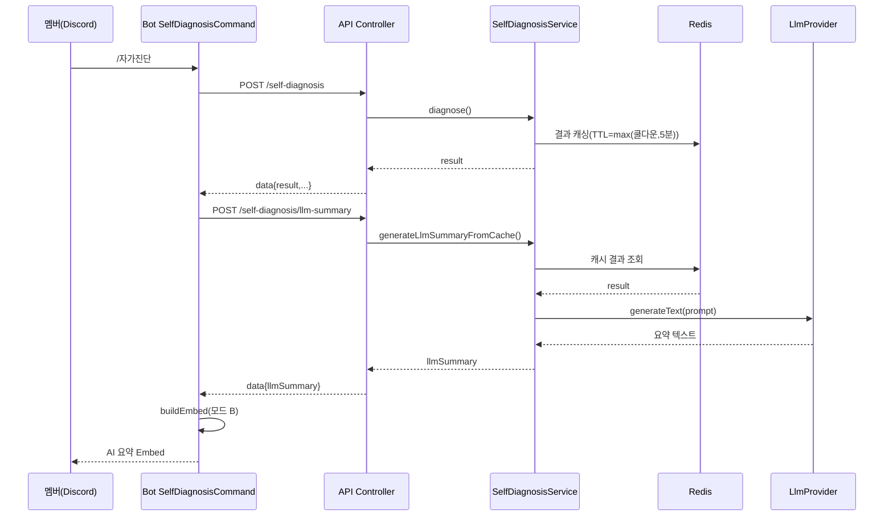

# 유스케이스 ID: UC-SD-04

### 제목
AI 요약 모드에서 진단 결과를 LLM 종합 진단으로 변환하여 표시한다 (bot 2단계 호출 → api LLM 위임)

---

## 1. 개요

### 1.1 목적
길드 정책이 AI 종합 진단(`isLlmSummaryEnabled=true`)을 켠 경우, `/자가진단` 결과를 LLM이 격려·개선 방향·뱃지 달성 팁이 담긴 자연어 요약으로 변환하여 Embed에 표시하는 cross-app 통합 흐름과, LLM 실패/할당량 초과 시의 graceful degradation을 검증한다.

### 1.2 범위
- 포함: 진단 결과 Redis 캐싱 → Bot의 2차 LLM 요약 요청 → API의 캐시 기반 프롬프트 빌딩 + `LlmProvider` 위임 → 모드 B Embed 렌더링
- 포함: LLM 실패 fallback(모드 A), 할당량 초과(429) 처리, 쿨다운/캐시 TTL 정합
- 제외: 정책 설정(UC-SD-02), 뱃지 산정(UC-SD-03), 일반 상세 데이터 모드(UC-SD-01 기본 플로우)

### 1.3 액터
- **주요 액터**: 서버 멤버
- **부 액터**:
  - Bot `SelfDiagnosisCommand` (2단계 호출: `runSelfDiagnosis` → `getSelfDiagnosisLlmSummary`)
  - API `BotVoiceAnalyticsController` (`/self-diagnosis`, `/self-diagnosis/llm-summary`)
  - API `SelfDiagnosisService.generateLlmSummaryFromCache()`
  - `LlmProvider` (Gemini 등 — `LLM_PROVIDER` 토큰, Optional 주입)
  - Redis (진단 결과 캐시 `voice-health:result:{guildId}:{userId}`)

---

## 2. 선행 조건

- 길드 정책이 활성이고 `isLlmSummaryEnabled=true`이다 (UC-SD-02).
- `LLM_PROVIDER`가 주입되어 있다(미주입 시 모드 A로 fallback).
- 진단(UC-SD-01)이 성공하여 결과가 Redis에 캐싱되어 있다.

---

## 3. 참여 컴포넌트

- **Bot `SelfDiagnosisCommand`**: 진단 성공 후 LLM 요약을 추가로 요청. 실패 시 모드 A로 대체.
- **API `runSelfDiagnosis`**: 진단 실행 시 `isLlmSummaryEnabled` 이면 결과를 Redis에 캐싱(TTL=max(쿨다운, 5분))
- **API `getSelfDiagnosisLlmSummary`** (`POST /self-diagnosis/llm-summary`): 캐시 기반 요약 위임
- **`SelfDiagnosisService.generateLlmSummaryFromCache`**: 캐시 조회 → 프롬프트 빌딩 → `LlmProvider.generateText`
- **`LlmProvider`**: 텍스트 생성. 할당량 초과 시 `LlmQuotaExhaustedException`
- **Redis**: 진단 결과 캐시(요약 생성 입력)

---

## 4. 기본 플로우 (Basic Flow)

### 4.1 단계별 흐름

1. **멤버**: `/자가진단` 실행 (UC-SD-01 1~7단계 동일)
   - `isLlmSummaryEnabled=true` 이므로 API가 `SelfDiagnosisResult`를 Redis에 캐싱(`voice-health:result:{guildId}:{userId}`, TTL=max(쿨다운초, 5분))

2. **Bot**: 진단 응답 수신 후, 활동 데이터가 있으면 2차로 `apiClient.getSelfDiagnosisLlmSummary(guildId, userId)` 호출

3. **API (`getSelfDiagnosisLlmSummary`)**: `generateLlmSummaryFromCache(guildId, userId)` 위임
   - 정책 재확인(`isEnabled` && `isLlmSummaryEnabled` && provider 존재) — 미충족 시 `null`
   - Redis 캐시 조회 — 없으면 `null`(이미 만료/미생성)

4. **`SelfDiagnosisService`**: 캐시된 결과로 프롬프트 구성
   - 활동량/관계 다양성(다양성 점수)/모코코 기여/참여 패턴/정책 준수 현황(verdicts)/뱃지 달성 현황 포함
   - 작성 지침: 4~5문장, 격려 톤, 미달 항목 개선 방향, 미달성 뱃지 중 근접 1~2개 달성 팁, 이모지 1~2개

5. **`LlmProvider.generateText(prompt)`**: 요약 텍스트 생성 → `{ data: { llmSummary } }` 반환

6. **Bot (`buildEmbed`)**: `result.llmSummary`가 채워졌으므로 **모드 B** 렌더링
   - 🤖 AI 요약 + 🏅 획득한 뱃지 + 📖 뱃지 가이드 (상세 데이터 4섹션 생략)
   - Footer: 분석 기간 + 다음 진단 가능 시각

7. **멤버**: AI 종합 진단 Embed 확인

### 4.2 시퀀스 다이어그램

---

## 5. 대안 플로우 (Alternative Flows)

### 5.1 대안 플로우 1: LLM 요약 실패 → 모드 A fallback
**시작 조건**: 2차 호출 실패, 캐시 만료, provider 미주입, 또는 요약 `null`.
**단계**: Bot이 경고 로그 후 `llmSummary` 미설정 상태로 진행 → `buildEmbed`가 모드 A(상세 4섹션 + 뱃지) 렌더링.
**결과**: AI 요약 없이도 진단 정상 표시(서비스 연속성 확보).

### 5.2 대안 플로우 2: AI 모드지만 활동 데이터 없음
**시작 조건**: `result.totalMinutes === 0`.
**단계**: Bot이 2차 LLM 호출 없이 "최근 N일간 음성 활동 기록이 없습니다." 안내.
**결과**: LLM 호출 비용 절약.

---

## 6. 예외 플로우 (Exception Flows)

### 6.1 예외 상황 1: LLM 할당량 초과 (429)
**발생 조건**: `LlmProvider`가 `LlmQuotaExhaustedException` throw.
**처리**:
- `/self-diagnosis/llm-summary` 경로: `{ data: null, reason: 'quota_exhausted' }` 반환 → Bot은 모드 A로 fallback(요약 없이 상세 표시).
- `runSelfDiagnosis` 경로에서 발생 시: `reason: 'quota_exhausted'` → Bot이 "AI 할당량 초과" 안내 Embed 표시.

### 6.2 예외 상황 2: 캐시 만료/미생성
**발생 조건**: 요약 요청 시점에 진단 결과 캐시가 없음.
**처리**: `generateLlmSummaryFromCache`가 경고 로그 후 `null` → 모드 A fallback.

### 6.3 예외 상황 3: provider 미주입
**발생 조건**: `LLM_PROVIDER` 미등록 환경.
**처리**: 정책이 AI 모드여도 요약 `undefined` → 모드 A.

---

## 7. 후행 조건 (Post-conditions)

### 7.1 성공 시
- **데이터베이스 변경**: 없음(읽기 + Redis 캐시).
- **시스템 상태**: 진단 결과 캐시는 TTL 만료까지 유지(쿨다운과 정합).
- **외부 시스템**: LLM API 1회 호출, 멤버에게 모드 B Embed 전달.

### 7.2 실패 시
- **데이터 롤백**: 없음.
- **시스템 상태**: LLM 실패는 진단 결과 자체를 무효화하지 않음(모드 A 보존).

---

## 8. 비기능 요구사항

### 8.1 성능
- LLM 호출은 진단과 분리된 2차 요청으로, 진단 표시를 블로킹하지 않는 fallback 경로 보장.
- 캐시 재사용으로 요약 생성 시 데이터 재집계 회피.

### 8.2 보안
- 🔒 **결제/비용**: LLM 호출은 외부 유료 API 호출 가능성. 할당량 초과는 비용 한도 보호로 graceful 처리. 호출 빈도는 쿨다운으로 제한.
- 프롬프트에 본인 데이터만 포함(타 멤버 식별 정보는 top peer 이름 한정, 본인 시점 노출).

### 8.3 가용성
- LLM 장애/할당량 초과 시에도 상세 데이터 모드로 100% 기능 유지.

---

## 9. UI/UX 요구사항

### 9.1 화면 구성 (모드 B)
- Title `🩺 음성 활동 자가진단`, Color Blurple
- 섹션: 🤖 AI 요약 / 🏅 획득한 뱃지 / 📖 뱃지 가이드 (상세 데이터 섹션 생략)
- 할당량 초과 시: "AI 할당량 초과" 안내 Embed(주황색).

### 9.2 사용자 경험
- AI 요약은 격려·구체적 팁 중심의 따뜻한 톤.
- LLM 실패가 사용자에게 빈 화면/오류로 노출되지 않고 자연스럽게 상세 모드로 전환.

---

## 10. 테스트 시나리오

### 10.1 성공 케이스

| 테스트 케이스 ID | 입력값 | 기대 결과 |
|----------------|--------|----------|
| TC-SD-04-01 | AI 모드 + 정상 LLM | 모드 B(AI 요약+뱃지) Embed |
| TC-SD-04-02 | AI 모드 진단 후 캐시 존재 | 2차 요약 호출이 캐시 기반으로 성공 |

### 10.2 실패 케이스

| 테스트 케이스 ID | 입력값 | 기대 결과 |
|----------------|--------|----------|
| TC-SD-04-03 | LLM 호출 실패 | 모드 A로 fallback(상세 4섹션) |
| TC-SD-04-04 | 할당량 초과(429) — 요약 경로 | reason quota_exhausted → 모드 A fallback |
| TC-SD-04-05 | 할당량 초과 — 진단 경로 | "AI 할당량 초과" 안내 Embed |
| TC-SD-04-06 | 캐시 만료 후 요약 요청 | null → 모드 A fallback |
| TC-SD-04-07 | provider 미주입 | 모드 A |

---

## 11. 관련 유스케이스

- **선행 유스케이스**: UC-SD-01 (진단 실행 + 결과 캐싱), UC-SD-02 (`isLlmSummaryEnabled` 설정)
- **연관 유스케이스**: UC-SD-03 (모드 B에도 뱃지 섹션 포함)

---

## 12. 변경 이력

| 버전 | 날짜 | 작성자 | 변경 내용 |
|------|------|--------|-----------|
| 1.0 | 2026-05-20 | usecase-writer | 초기 작성 |

---

## 부록

### A. 용어 정의
- **모드 A / 모드 B**: A=상세 데이터 4섹션, B=AI 요약 중심.
- **`LlmQuotaExhaustedException`**: LLM 할당량(429) 초과 신호.
- **2단계 호출**: 진단(데이터) → 요약(LLM)을 분리하여 LLM 장애 격리.

### B. 참고 자료
- PRD: `/docs/specs/prd/self-diagnosis.md` (F-SD-001, F-SD-005 모드 B)
- 코드: bot `apps/bot/src/command/voice-analytics/self-diagnosis.command.ts`; api `apps/api/src/bot-api/voice-analytics/bot-voice-analytics.controller.ts`, `.../self-diagnosis/application/self-diagnosis.service.ts` (`generateLlmSummaryFromCache`), `apps/api/src/common/llm/llm-provider.interface.ts`
