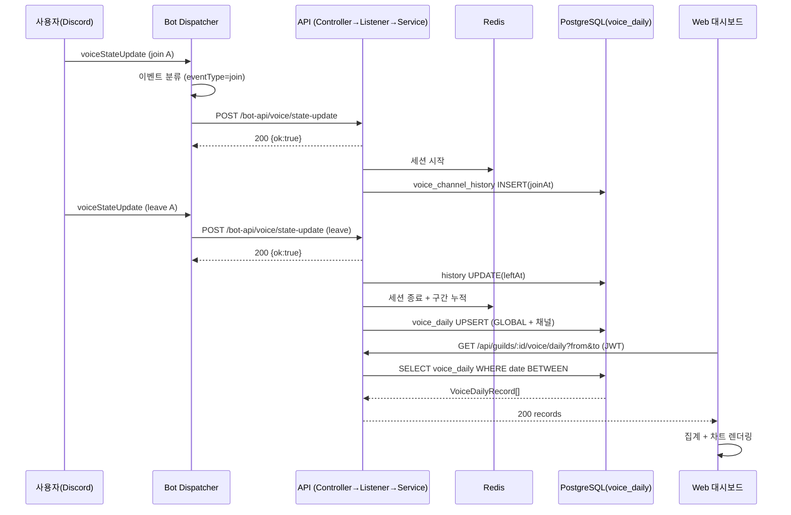

# 유스케이스 ID: UC-01

### 제목
음성 활동 실시간 추적부터 대시보드 표시까지 (bot → api → web end-to-end)

---

## 1. 개요

### 1.1 목적
디스코드 멤버의 음성 채널 입장·이탈·이동·상태 변경(마이크/화면공유/카메라/스피커 음소거/게임)을 봇이 감지하여 API로 전달하고, API가 Redis 세션으로 시간을 누적한 뒤 `voice_daily` 테이블에 일별로 집계하여, 웹 대시보드가 이를 시각화하기까지의 cross-app 통합 흐름이 끊김 없이 동작함을 보장한다.

### 1.2 범위
- **포함**: `voiceStateUpdate` 이벤트 분류(bot), HTTP 전달(bot↔api), 이벤트 분배·세션 추적(api), Redis→`voice_daily` flush(api), 대시보드 조회 API + 웹 렌더링(web)
- **제외**: 자동방 생성 상세 로직, 게임 세션 DB 저장 상세(F-VOICE-031), AI 분석(gemini 도메인), `/me` 커맨드 응답 조립. 본 UC는 데이터가 3앱을 통과하는 통합 정합성에 집중한다.

### 1.3 액터
- **주요 액터**: 디스코드 음성 채널 사용자 (입퇴장 발생 주체)
- **부 액터**:
  - Discord Gateway (`voiceStateUpdate` 이벤트 발행)
  - 서버 관리자 (웹 대시보드 조회자)
  - 시스템 컴포넌트: Bot, API, Redis, PostgreSQL, Web

---

## 2. 선행 조건

- 봇이 디스코드 서버(길드)에 초대되어 있고 음성 상태를 수신할 수 있다.
- 사용자가 봇이 추적 가능한 음성 채널에 입장할 수 있는 권한이 있다.
- 대시보드 조회자는 Discord OAuth 로그인을 완료하여 유효한 JWT를 보유하며, 해당 길드 멤버다.
- 해당 채널이 음성 시간 제외 채널(UC-03)로 설정되어 있지 않다.

---

## 3. 참여 컴포넌트

- **Bot — `BotVoiceStateDispatcher`** (`apps/bot/src/event/voice/`): `voiceStateUpdate`를 수신해 이벤트 타입(join/leave/move/mic_toggle/streaming_toggle/video_toggle/deaf_toggle)으로 분류하고, 채널 멤버 수·게임 활동·아바타 등 컨텍스트를 담아 API로 전달
- **Bot API Client** (`libs/bot-api-client`): bot→api HTTP 전송 (`sendVoiceStateUpdate`)
- **API Entrypoint — `BotVoiceController`** (`POST /bot-api/voice/state-update`): 봇 전용 인증 가드 통과 후 내부 이벤트(`bot-api.voice.state-update`) 발행
- **API Business — `BotVoiceEventListener`**: 이벤트 타입별 분배, 제외 채널·자동방 트리거 분기, 세션 서비스 호출
- **API Business — `VoiceChannelService`**: 입퇴장/이동/토글 비즈니스 로직 (히스토리·세션 관리)
- **Persistence — Redis (`VoiceRedisRepository`)**: 현재 세션·구간별 누적 시간 임시 저장
- **API Business — `VoiceDailyFlushService`**: Redis 누적 시간을 `voice_daily`로 flush (세션 종료 시 / 스케줄 / 명시적 flush)
- **Persistence — PostgreSQL (`voice_channel_history`, `voice_daily`)**: 입퇴장 이력 및 일별 집계 영구 저장
- **API Entrypoint — `VoiceDailyController`** (`GET /api/guilds/:guildId/voice/daily`): JWT 가드 적용된 대시보드 조회 API
- **Web 프록시** (`apps/web/app/api/guilds/[...path]/route.ts`): 브라우저 요청을 백엔드로 중계
- **Web Presentation — `VoiceDashboardPage`** + 차트 컴포넌트 5종: 요약 카드, 일별 추이, 마이크 분포, 채널별 막대, 유저 랭킹 렌더링

---

## 4. 기본 플로우 (Basic Flow)

### 4.1 단계별 흐름

1. **사용자**: 음성 채널 A에 입장
   - 입력: Discord 음성 상태 변경
   - 처리: Discord Gateway가 `voiceStateUpdate(oldState=null channel, newState=A)` 이벤트 발행

2. **Bot (`BotVoiceStateDispatcher`)**: 이벤트 분류
   - 처리: `oldChannelId` 없음 + `channelId` 있음 → `eventType = 'join'`. 채널 내 봇 제외 멤버 수, 게임 활동(`ActivityType.Playing`), 카테고리 정보, 아바타 URL, 마이크/streaming/video/deaf 상태 수집
   - 출력: `VoiceStateUpdateDto` payload

3. **Bot → API**: `POST /bot-api/voice/state-update` 전송 (봇 전용 인증 헤더 포함)

4. **API (`BotVoiceController`)**: payload 수신
   - 처리: 봇 인증 가드 통과 후 내부 이벤트 `bot-api.voice.state-update` 발행
   - 출력: `{ ok: true }` (200) 즉시 응답 (처리는 비동기)

5. **API (`BotVoiceEventListener`)**: 이벤트 분배
   - 처리: `eventType='join'` → `handleJoin()`. 제외 채널 여부 확인 → 미제외, 자동방 트리거 채널 아님 확인 → `VoiceChannelService.onUserJoined(state)` 호출. 게임 활동 있으면 게임 세션 시작(fire-and-forget), alone 상태 갱신
   - 출력: `voice_channel_history` 레코드 생성(joinAt) + Redis 세션 시작

6. **사용자**: 일정 시간 후 채널 A에서 퇴장 → `voiceStateUpdate(old=A, new=null)`

7. **Bot → API**: `eventType='leave'` payload 전송 (4단계와 동일 경로)

8. **API (`BotVoiceEventListener.handleLeave`)**: `VoiceChannelService.onUserLeave(state)` 호출
   - 처리: `voice_channel_history.leftAt` 기록, 체류 시간 계산, Redis 세션 종료, 시간 구간 누적

9. **API (`VoiceDailyFlushService`)**: Redis 누적 시간을 `voice_daily`로 flush
   - 처리: 세션별 채널 체류 시간·마이크 ON/OFF·혼자시간·화면공유·카메라·deaf 시간을 GLOBAL 및 개별 채널 레코드로 upsert (복합키 `guildId+userId+date+channelId`)
   - 출력: `voice_daily` 레코드 누적

10. **관리자**: 웹 대시보드(`/dashboard/guild/{guildId}/voice`) 접속, 기간(예: 7일) 선택

11. **Web (`VoiceDashboardPage`)**: `fetchVoiceDaily(guildId, from, to)` 호출 → Next.js 프록시 → `GET /api/guilds/{guildId}/voice/daily?from=&to=`

12. **API (`VoiceDailyController`)**: JWT 가드 + 길드 멤버십 검증 후 `date BETWEEN from AND to` 조건으로 `voice_daily` 조회
    - 출력: `VoiceDailyRecord[]` JSON

13. **Web**: 렌더링 시점 집계
    - 처리: `computeSummary`/`computeDailyTrends`/`computeChannelStats`/`computeUserStats`로 클라이언트 집계, 멤버 프로필 일괄 조회
    - 출력: 요약 카드 + 추이 차트 + 마이크 분포 + 채널 막대 + 유저 랭킹 렌더링

### 4.2 시퀀스 다이어그램

---

## 5. 대안 플로우 (Alternative Flows)

### 5.1 대안 플로우 1: 채널 이동 (move)

**시작 조건**: 사용자가 채널 A에서 B로 직접 이동 (2단계에서 `oldChannelId`와 `channelId`가 모두 존재하고 서로 다름)

**단계**:
1. Bot이 `eventType='move'`로 분류하여 전송
2. API `handleMove()`가 A·B 각각의 제외 여부와 B의 자동방 트리거 여부를 판정
3. 둘 다 일반 채널이면 `VoiceChannelService.onUserMove(oldState, newState)` — A 퇴장 + B 입장을 단일 호출로 처리

**결과**: A 세션 종료·누적, B 세션 시작. 양쪽 채널 alone 상태 갱신

### 5.2 대안 플로우 2: 상태 토글 (마이크/화면공유/카메라/deaf)

**시작 조건**: 채널 변경 없이 `selfMute`/`streaming`/`selfVideo`/`selfDeaf`만 변경

**단계**:
1. Bot이 변경된 상태에 따라 `mic_toggle`/`streaming_toggle`/`video_toggle`/`deaf_toggle`로 분류
2. API가 제외 채널 확인 후 해당 토글 서비스 메서드 호출 → Redis에 직전 구간 누적 시각 기록
3. 다음 토글 또는 퇴장/flush 시점에 `voice_daily`의 `micOnSec`/`micOffSec`/`streamingSec`/`videoOnSec`/`deafSec`에 반영

**결과**: 상태별 누적 시간이 일별 집계에 합산됨

### 5.3 대안 플로우 3: 활동 데이터 없는 기간 조회

**시작 조건**: 대시보드 조회 기간에 `voice_daily` 레코드가 0건

**단계**:
1. API가 빈 배열 반환
2. Web의 `computeSummary` 등이 0/빈 상태로 처리

**결과**: 대시보드에 "0" 또는 빈 차트 표시 (에러 아님)

---

## 6. 예외 플로우 (Exception Flows)

### 6.1 예외 상황 1: bot→api HTTP 전송 실패

**발생 조건**: API 다운/네트워크 오류로 `sendVoiceStateUpdate` 실패

**처리 방법**:
1. Bot Dispatcher의 try/catch가 에러를 로깅 (`[BOT] voiceStateUpdate forwarding failed`)
2. 해당 이벤트는 유실 (재시도 큐 없음) — Discord 이벤트 단위 처리이므로 다음 이벤트는 정상 진행

**사용자 메시지**: 없음 (백그라운드 추적, 사용자 비노출)

### 6.2 예외 상황 2: 대시보드 조회 인증 실패

**발생 조건**: JWT 만료/누락 또는 요청 길드가 사용자의 길드 목록에 없음

**처리 방법**:
1. `JwtAuthGuard` / 길드 멤버십 가드가 차단
2. Web `fetchVoiceDaily`의 catch가 에러 상태 설정

**에러 코드**: `401 Unauthorized` / `403 Forbidden`

**사용자 메시지**: 대시보드에 로드 실패 메시지 (`error.loadFailed`) 표시

### 6.3 예외 상황 3: API 처리 중 비즈니스 로직 실패

**발생 조건**: `BotVoiceEventListener.handle` 내부 예외 (DB/Redis 오류 등)

**처리 방법**:
1. 리스너 try/catch가 `[BOT-API VOICE] {eventType} failed` 로깅
2. 컨트롤러는 이미 200을 반환했으므로 봇에는 영향 없음. 해당 이벤트만 누적 누락

**사용자 메시지**: 없음 (다음 flush/이벤트로 부분 복구 가능)

---

## 7. 후행 조건 (Post-conditions)

### 7.1 성공 시
- **데이터베이스 변경**:
  - `voice_channel_history`: 입장 시 레코드 생성(joinAt), 퇴장 시 leftAt 기록
  - `voice_daily`: GLOBAL 레코드(마이크/혼자/화면공유/카메라/deaf 시간) + 개별 채널 레코드(체류 시간) upsert
- **시스템 상태**: Redis 세션은 퇴장/flush 후 정리, 대시보드는 최신 집계를 반영
- **외부 시스템**: Discord 측 변경 없음 (읽기 전용 추적)

### 7.2 실패 시
- **데이터 롤백**: 개별 이벤트 단위 처리이므로 트랜잭션 롤백 대상은 해당 이벤트의 부분 누적에 한정. 유실된 이벤트는 복구되지 않음
- **시스템 상태**: 활성 세션은 Redis에 잔존하다 `safeFlushAll` 또는 봇 재시작 복구(UC-02)로 보완

---

## 8. 비기능 요구사항

### 8.1 성능
- bot→api 전송은 fire-and-forget성으로 컨트롤러가 즉시 200 반환 (Discord 이벤트 처리 지연 최소화)
- 대시보드 집계는 클라이언트 렌더링 시점 계산 — `channelTypeFilter` 변경 시 API 재호출 없음

### 8.2 보안
- bot↔api 구간: `BotApiAuthGuard` (봇 전용 토큰)
- web↔api 구간: `JwtAuthGuard` + 길드 멤버십 가드 (`/api/guilds/:guildId/*` 전역)
- 🔒 PII: 디스코드 사용자 ID·닉네임·아바타 URL·음성 체류 로그가 저장됨. `voice_daily`/`voice_channel_history`는 90일 보존(`DATA_RETENTION_DAYS`), 사용자 본인 삭제 API(`DELETE /api/users/me/data`) 제공

### 8.3 가용성
- API 일시 장애 시 봇 이벤트는 유실되나 봇 자체는 계속 동작. 재시작 시 UC-02로 활성 세션 보정

---

## 9. UI/UX 요구사항

### 9.1 화면 구성
- 기간 선택 드롭다운(7/14/30/60/90일), 요약 카드, 일별 추이 라인, 마이크 분포, 채널별 막대(채널 타입 필터), 유저 랭킹 테이블(페이지네이션 + 프로필)

### 9.2 사용자 경험
- 유저 행 클릭 시 `?userId=` 쿼리로 상세 뷰 전환, 기간 변경 시 로딩 상태 표시

---

## 10. 테스트 시나리오

### 10.1 성공 케이스

| 테스트 케이스 ID | 입력값 | 기대 결과 |
|----------------|--------|----------|
| TC-01-01 | 채널 A 입장 후 1시간 뒤 퇴장 | `voice_daily` GLOBAL+채널 레코드에 약 3600초 누적, 대시보드 요약에 반영 |
| TC-01-02 | A→B 이동 | A 세션 종료·B 세션 시작, 두 채널 레코드 모두 시간 누적 |
| TC-01-03 | 마이크 ON 30분 → OFF 30분 후 퇴장 | `micOnSec≈1800`, `micOffSec≈1800` |
| TC-01-04 | 7일 기간 대시보드 조회 (JWT 유효, 길드 멤버) | 200 + 해당 기간 레코드 배열, 차트 정상 렌더 |

### 10.2 실패 케이스

| 테스트 케이스 ID | 입력값 | 기대 결과 |
|----------------|--------|----------|
| TC-01-05 | bot→api 전송 시 API 다운 | 봇 에러 로그, 이벤트 유실, 봇은 계속 동작 |
| TC-01-06 | JWT 없이 대시보드 조회 | 401, 대시보드 로드 실패 메시지 |
| TC-01-07 | 타 길드 guildId로 조회 | 403 (멤버십 가드 차단) |

---

## 11. 관련 유스케이스

- **선행 유스케이스**: UC-02(봇 재시작 시 활성 세션 복구) — 추적 연속성 보장
- **연관 유스케이스**: UC-03(제외 채널 필터링) — 본 흐름의 추적 차단 분기

---

## 12. 변경 이력

| 버전 | 날짜 | 작성자 | 변경 내용 |
|------|------|--------|-----------|
| 1.0 | 2026-05-20 | usecase-writer | 초기 작성 |

---

## 부록

### A. 용어 정의
- **GLOBAL 레코드**: `channelId='GLOBAL'`인 `voice_daily` 행. 유저의 채널 무관 마이크/혼자/상태 시간 집계
- **flush**: Redis 임시 누적 시간을 `voice_daily`로 영구 반영하는 작업
- **세션**: Redis에 저장된 유저의 현재 음성 접속 상태(입장 시각·채널·구간 누적)

### B. 참고 자료
- PRD: `/docs/specs/prd/voice.md` (F-VOICE-001~006, F-VOICE-017)
- 코드: `apps/bot/src/event/voice/bot-voice-state.dispatcher.ts`, `apps/api/src/bot-api/voice/`, `apps/api/src/channel/voice/application/voice-channel.service.ts`, `voice-daily-flush-service.ts`, `apps/api/src/channel/voice/presentation/voice-daily.controller.ts`, `apps/web/app/dashboard/guild/[guildId]/voice/page.tsx`
