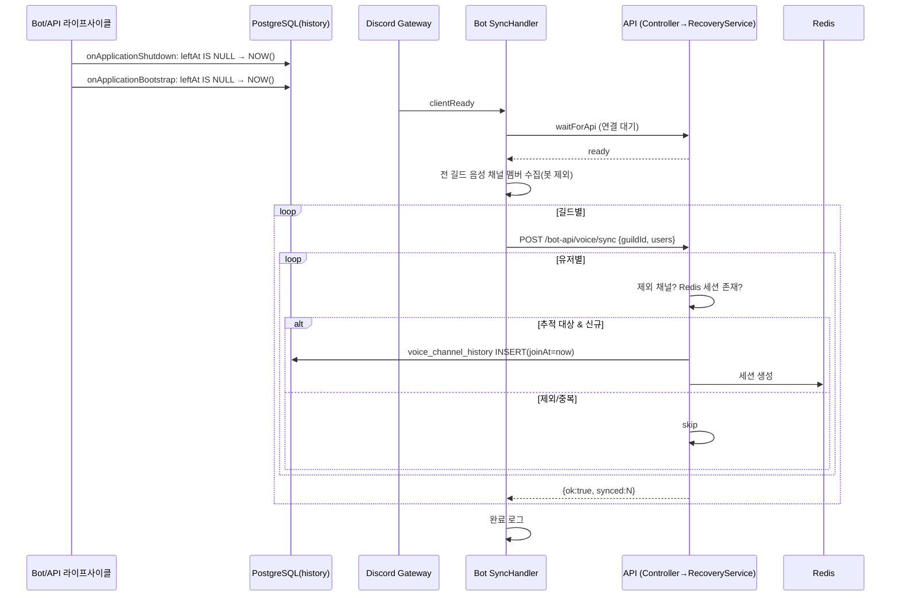

# 유스케이스 ID: UC-02

### 제목
봇 재시작 시 음성 세션 복구 동기화 (bot → api, F-VOICE-023)

---

## 1. 개요

### 1.1 목적
봇이 배포/크래시로 재시작되면 (1) 음성 채널에 있던 유저의 `voice_channel_history.leftAt`이 `null`로 남아 고아 레코드가 되고, (2) Discord 재연결 시 이미 음성에 접속해 있던 유저에 대해서는 `voiceStateUpdate` 이벤트가 발생하지 않아 새 세션이 만들어지지 않는다. 본 유스케이스는 정상 종료·부팅·Discord ready의 3단계에 걸쳐 고아 레코드를 정리하고 현재 접속 중인 유저의 세션을 재구성하여 추적 연속성을 보장한다.

### 1.2 범위
- **포함**: 종료 시 고아 레코드 종료, 부팅 시 고아 레코드 보정, Discord ready 후 bot→api 음성 상태 동기화(`POST /bot-api/voice/sync`)
- **제외**: 정상 운영 중 실시간 추적(UC-01), Redis 세션의 일반 flush 로직 상세

### 1.3 액터
- **주요 액터**: 시스템 (봇 프로세스 라이프사이클 이벤트가 트리거)
- **부 액터**:
  - Discord Gateway (`clientReady` 이벤트, 음성 채널 멤버 상태 제공)
  - 음성 채널에 접속 중인 디스코드 사용자 (복구 대상)
  - 시스템 컴포넌트: Bot, API, PostgreSQL, Redis

---

## 2. 선행 조건

- 봇이 재시작(배포/크래시/수동 재기동)된다.
- API 인스턴스가 가동 중이거나 곧 가동된다 (봇이 `waitForApi`로 연결 대기).
- 봇이 디스코드 서버에 여전히 초대된 상태로 음성 채널 멤버를 조회할 수 있다.

---

## 3. 참여 컴포넌트

- **API Business — `VoiceRecoveryService`** (`apps/api/src/channel/voice/application/voice-recovery.service.ts`): 1~2단계(`OnApplicationShutdown`/`OnApplicationBootstrap`)에서 고아 레코드 일괄 종료, 3단계 `syncVoiceStates()` 제공
- **API Business — `VoiceChannelHistoryService`**: `leftAt IS NULL` 레코드 일괄 종료 메서드
- **Bot — `BotVoiceSyncHandler`** (`apps/bot/src/event/voice/bot-voice-sync.handler.ts`): Discord `clientReady` 후 전 길드 음성 채널 순회, 봇 제외 멤버 수집, 길드별 API 전송
- **Bot API Client** (`libs/bot-api-client`): `pushVoiceSync()` (`VoiceSyncDto`/`VoiceSyncUser`)
- **API Entrypoint — `BotVoiceController`** (`POST /bot-api/voice/sync`): 동기화 페이로드 수신
- **API Business — `VoiceExcludedChannelService`**: 제외 채널 필터링(`isExcludedChannel`)
- **API Business — `VoiceChannelService.onUserJoined()`**: 새 세션·히스토리 생성(재사용)
- **Persistence — PostgreSQL / Redis**: 고아 레코드 종료 / 세션 재생성

---

## 4. 기본 플로우 (Basic Flow)

### 4.1 단계별 흐름

1. **시스템 (정상 종료, `onApplicationShutdown`)**:
   - 처리: 기존 Redis 세션 flush(현행) → `voice_channel_history`에서 `leftAt IS NULL` 레코드를 `leftAt = NOW()`로 일괄 종료
   - 출력: 고아 레코드 없음 보장(정상 종료 경로)

2. **시스템 (부팅, `onApplicationBootstrap`)**:
   - 처리: `voice_channel_history`에서 `leftAt IS NULL` 레코드를 `leftAt = NOW()`로 일괄 종료 (크래시로 1단계 미실행 시 보완) → 기존 Redis orphan 세션 flush
   - 출력: 부팅 시점까지의 미종료 레코드 정리 완료

3. **Bot (`clientReady`, `BotVoiceSyncHandler`)**:
   - 처리: API 연결 대기(`waitForApi`). 실패 시 sync 중단 + 에러 로그
   - 출력: API 연결 확인

4. **Bot**: 전 길드 음성 채널 순회
   - 처리: 길드별로 `GuildVoice` 채널의 봇 제외 멤버를 수집 — userId·channelId·채널명·카테고리·닉네임·아바타·마이크/streaming/video/deaf·게임 활동
   - 출력: 길드별 `VoiceSyncUser[]` (멤버 0명 길드는 skip)

5. **Bot → API**: 길드별 `POST /bot-api/voice/sync` 전송 (`pushVoiceSync`)

6. **API (`BotVoiceController.handleVoiceSync`)**: 페이로드 수신 → `VoiceRecoveryService.syncVoiceStates(guildId, users)` 호출

7. **API (`VoiceRecoveryService.syncVoiceStates`)**: 유저별 복구
   - 처리: 각 유저에 대해 (a) 제외 채널 확인(`isExcludedChannel`) → 제외면 skip, (b) 이미 Redis 세션 존재 시 skip(중복 방지), (c) 그 외 `VoiceChannelService.onUserJoined()` 호출 → 새 `voice_channel_history` + Redis 세션 생성
   - 출력: 복구된 유저 수(`synced`)

8. **API → Bot**: `{ ok: true, synced }` 응답

9. **Bot**: 길드별 동기화 결과 로그, 전체 완료 로그(`Complete — N user(s) synced`) 출력

### 4.2 시퀀스 다이어그램

---

## 5. 대안 플로우 (Alternative Flows)

### 5.1 대안 플로우 1: 크래시 (1단계 미실행)

**시작 조건**: 봇이 정상 종료 훅 없이 강제 종료됨

**단계**:
1. 1단계(`onApplicationShutdown`)가 실행되지 않아 고아 레코드가 남음
2. 2단계(`onApplicationBootstrap`)가 `leftAt IS NULL` 레코드를 봇 재시작 시각으로 종료

**결과**: `leftAt`은 실제 퇴장 시각이 아닌 재시작 시각으로 기록됨 (정확한 퇴장 시각 불가 → 허용)

### 5.2 대안 플로우 2: 동기화 대상 유저가 제외 채널에 있음

**시작 조건**: 7단계에서 유저의 현재 채널이 제외 채널/카테고리

**단계**:
1. `isExcludedChannel`이 true 반환 → 해당 유저 skip (세션·히스토리 미생성)

**결과**: 제외 채널 유저는 추적 재개되지 않음 (UC-03 정책과 일관)

### 5.3 대안 플로우 3: 이미 Redis 세션 존재

**시작 조건**: 짧은 재연결 등으로 Redis 세션이 아직 살아있음

**단계**:
1. 중복 확인에서 기존 세션 발견 → skip (이중 세션·이중 히스토리 방지)

**결과**: 기존 세션 유지, 새 레코드 미생성

---

## 6. 예외 플로우 (Exception Flows)

### 6.1 예외 상황 1: API 연결 실패

**발생 조건**: `clientReady` 후 `waitForApi`가 시간 내 API 연결에 실패

**처리 방법**:
1. Bot이 `[VOICE-SYNC] API 연결 실패 — voice sync 중단` 로그 후 3단계 전체 중단

**사용자 메시지**: 없음 (운영 로그). 1~2단계 고아 정리는 이미 완료되어 데이터 무결성은 유지

### 6.2 예외 상황 2: 특정 길드 sync 전송 실패

**발생 조건**: 한 길드의 `pushVoiceSync` HTTP 실패

**처리 방법**:
1. 해당 길드만 에러 로그(`guild=... sync failed`) 후 다음 길드 계속 진행 (전체 중단 아님)

**사용자 메시지**: 없음

---

## 7. 후행 조건 (Post-conditions)

### 7.1 성공 시
- **데이터베이스 변경**: 모든 고아 `voice_channel_history` 레코드 종료, 현재 접속 유저에 대한 신규 히스토리 생성
- **시스템 상태**: Redis에 현재 접속 유저 세션 재구성 완료, 추적 연속성 회복
- **외부 시스템**: Discord 측 변경 없음

### 7.2 실패 시
- **데이터 롤백**: 유저 단위 처리이므로 실패 유저만 미복구. 고아 정리(1~2단계)는 sync(3단계)와 독립적으로 이미 적용됨
- **시스템 상태**: 일부 유저 추적 누락 가능 — 다음 정상 이벤트(퇴장 등) 또는 재시작 시 보정

---

## 8. 비기능 요구사항

### 8.1 성능
- 3단계는 `clientReady` 이후 1회 실행. 길드 수·접속자 수에 비례하나 길드별 배치 전송으로 부하 분산

### 8.2 보안
- bot↔api 구간 `BotApiAuthGuard` 적용
- 🔒 PII: 동기화 페이로드에 디스코드 userId·닉네임·아바타 URL·게임명이 포함되며 `voice_channel_history`에 사용자 ID가 영구(보존정책 90일) 저장됨. 음성 활동 로그 = 개인 활동 추적 데이터로 취급

### 8.3 가용성
- 1~2단계는 API 단독 라이프사이클로 동작하여 봇/Discord 상태와 무관하게 데이터 정합성 보장
- 3단계는 `clientReady` 이후에만 실행 (Discord 캐시 준비 보장)

---

## 9. UI/UX 요구사항

해당 없음 (백그라운드 시스템 복구. 사용자/관리자 UI 노출 없음)

---

## 10. 테스트 시나리오

### 10.1 성공 케이스

| 테스트 케이스 ID | 입력값 | 기대 결과 |
|----------------|--------|----------|
| TC-02-01 | 정상 종료 시 음성 접속자 2명 존재 | 종료 시 2개 history 레코드 leftAt 기록 |
| TC-02-02 | 크래시 후 재부팅, 고아 레코드 3건 | 부팅 시 3건 모두 leftAt=재시작시각으로 종료 |
| TC-02-03 | clientReady 후 음성 접속자 5명(제외 0) | sync로 5명 신규 세션·히스토리 생성, `synced=5` |
| TC-02-04 | 접속자 중 1명이 제외 채널 | 해당 1명 skip, `synced=4` |
| TC-02-05 | 접속자 중 1명 Redis 세션 잔존 | 해당 1명 skip(중복 방지) |

### 10.2 실패 케이스

| 테스트 케이스 ID | 입력값 | 기대 결과 |
|----------------|--------|----------|
| TC-02-06 | API 미가동 상태로 clientReady | sync 중단 로그, 봇 정상 가동 |
| TC-02-07 | 특정 길드 sync HTTP 실패 | 해당 길드만 에러 로그, 나머지 길드 계속 |

---

## 11. 관련 유스케이스

- **연관 유스케이스**: UC-01(정상 운영 중 실시간 추적), UC-03(제외 채널 필터링 — sync 시에도 동일 정책 적용)

---

## 12. 변경 이력

| 버전 | 날짜 | 작성자 | 변경 내용 |
|------|------|--------|-----------|
| 1.0 | 2026-05-20 | usecase-writer | 초기 작성 |

---

## 부록

### A. 용어 정의
- **고아 레코드(orphan)**: `leftAt`이 `null`로 남아 종료되지 않은 `voice_channel_history` 행
- **sync(3단계)**: 봇이 현재 음성 접속 멤버를 수집해 API로 보내 세션을 재구성하는 복구 절차

### B. 참고 자료
- PRD: `/docs/specs/prd/voice.md` (F-VOICE-023, F-VOICE-024)
- 코드: `apps/bot/src/event/voice/bot-voice-sync.handler.ts`, `apps/api/src/bot-api/voice/bot-voice.controller.ts`, `apps/api/src/channel/voice/application/voice-recovery.service.ts`, `voice-channel-history.service.ts`, `voice-channel.service.ts`, `libs/bot-api-client`
