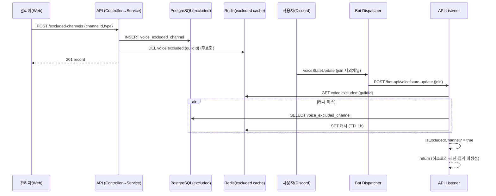

# 유스케이스 ID: UC-03

### 제목
제외 채널 설정의 cross-app 추적 차단 일관성 (web → api → bot 이벤트, F-VOICE-013~016)

---

## 1. 개요

### 1.1 목적
관리자가 웹 대시보드에서 등록한 음성 시간 제외 채널/카테고리 설정이, 봇이 보낸 음성 이벤트를 API가 처리하는 모든 경로(입장·퇴장·이동·각종 토글·재시작 sync)에서 일관되게 추적을 차단함을 보장한다. 즉 "설정(web→api)"과 "추적 차단(bot event→api)"이 동일한 제외 판정 로직을 공유하여 정합성을 유지하는지 통합 검증한다.

### 1.2 범위
- **포함**: 제외 채널 CRUD API(web↔api), Redis 캐시 무효화, 음성 이벤트 처리 시 제외 판정(F-VOICE-016), 이동 이벤트의 부분 처리 규칙, sync(UC-02) 시 제외 적용
- **제외**: 음성 시간 누적 상세 계산(UC-01), 자동방 트리거 채널 분기 상세

### 1.3 액터
- **주요 액터**: 서버 관리자 (제외 채널 설정 주체)
- **부 액터**:
  - 디스코드 음성 채널 사용자 (제외 채널에 입퇴장하는 대상)
  - 시스템 컴포넌트: Web, API, Redis, Bot, Discord API

---

## 2. 선행 조건

- 관리자가 Discord OAuth 로그인을 완료하여 유효한 JWT를 보유하며 해당 길드 멤버다.
- 제외하려는 채널/카테고리의 디스코드 채널 ID를 알 수 있다(웹 채널 선택 UI 제공).
- 봇이 길드의 `voiceStateUpdate` 이벤트를 수신하여 API로 전달 중이다.

---

## 3. 참여 컴포넌트

- **Web Presentation** (`apps/web/app/dashboard/guild/[guildId]/voice/` 설정 영역): 제외 채널 선택·등록·삭제 UI
- **Web 프록시** (`apps/web/app/api/guilds/[...path]/route.ts`): 백엔드 중계
- **API Entrypoint — `VoiceExcludedChannelController`** (`/api/guilds/:guildId/voice/excluded-channels`, JWT 가드): 조회(GET)·등록(POST)·전체 교체(PUT)·삭제(DELETE)
- **API Business — `VoiceExcludedChannelService`**: CRUD + `isExcludedChannel()` 판정 + `voice:excluded:{guildId}` Redis 캐시 관리
- **Persistence — PostgreSQL (`voice_excluded_channel`)**: 제외 채널/카테고리 영구 저장
- **Persistence — Redis (`voice:excluded:{guildId}`)**: 제외 목록 캐시(TTL 1시간), 설정 변경 시 무효화
- **API Business — `BotVoiceEventListener`**: 음성 이벤트 처리 직전 `isExcludedChannel` 호출(F-VOICE-016)
- **API Business — `VoiceRecoveryService`**: sync 시에도 동일 제외 판정 적용(UC-02 연계)
- **Discord API**: `CATEGORY` 타입 판정 시 채널의 parentId(카테고리) 조회

---

## 4. 기본 플로우 (Basic Flow)

### 4.1 단계별 흐름

1. **관리자**: 웹 대시보드에서 제외할 음성 채널(또는 카테고리) 선택 후 저장
   - 입력: `{ channelId, type: 'CHANNEL' | 'CATEGORY' }`
   - 처리: Web → Next.js 프록시 → `POST /api/guilds/{guildId}/voice/excluded-channels`

2. **API (`VoiceExcludedChannelController.saveExcludedChannel`)**: JWT + 멤버십 가드 통과 후 서비스 호출

3. **API (`VoiceExcludedChannelService`)**: 제외 채널 등록
   - 처리: 동일 `guildId+channelId` 중복 확인 → 신규면 `voice_excluded_channel` 레코드 생성 → `voice:excluded:{guildId}` Redis 캐시 무효화(삭제)
   - 출력: 201 + 생성된 레코드

4. **사용자**: 이후 해당(제외) 채널에 입장 → Discord `voiceStateUpdate` 발생

5. **Bot → API**: `eventType='join'` payload 전송 (UC-01 경로)

6. **API (`BotVoiceEventListener.handleJoin`)**: 제외 판정 (F-VOICE-016)
   - 처리: `isExcludedChannel(guildId, channelId, parentCategoryId)` 호출
     - `voice:excluded:{guildId}` Redis 캐시 조회 → 캐시 미스 시 DB 조회 후 캐시에 저장(TTL 1시간)
     - `type=CHANNEL`: channelId 직접 일치 확인
     - `type=CATEGORY`: 해당 채널의 parentId(이벤트 payload의 `parentCategoryId`)와 일치 확인
   - 출력: 제외 대상이면 `return` → `VoiceChannelHistory` 미생성, `voice_daily` 미누적, Redis 세션 미생성

7. **결과**: 제외 채널 활동은 어떤 통계에도 집계되지 않음. 이후 대시보드(UC-01)에도 해당 채널 데이터 미표출

### 4.2 시퀀스 다이어그램

---

## 5. 대안 플로우 (Alternative Flows)

### 5.1 대안 플로우 1: 카테고리 단위 제외

**시작 조건**: `type='CATEGORY'`로 등록

**단계**:
1. 해당 카테고리 하위 모든 음성 채널이 제외 대상이 됨(하위 채널 개별 등록 불필요)
2. 이벤트 처리 시 채널의 parentId가 등록된 카테고리 ID와 일치하면 차단

**결과**: 카테고리 하위 채널 전체 추적 차단

### 5.2 대안 플로우 2: 제외↔일반 채널 간 이동

**시작 조건**: move 이벤트에서 A·B 중 한쪽만 제외 채널 (F-VOICE-016 이동 세부 규칙)

**단계**:
1. A(제외) → B(일반): B 입장만 처리, A 퇴장 생략
2. A(일반) → B(제외): A 퇴장만 처리, B 입장 생략
3. A·B 모두 제외: 이동 이벤트 전체 무시

**결과**: 제외 채널 구간은 누적되지 않고 일반 채널 구간만 정상 추적

### 5.3 대안 플로우 3: 제외 채널 삭제 (설정 해제)

**시작 조건**: 관리자가 제외 항목 삭제 (`DELETE .../excluded-channels/:id`)

**단계**:
1. `voice_excluded_channel` 레코드 삭제(id+guildId 검증) → Redis 캐시 무효화
2. 이후 입장부터 정상 추적 재개

**결과**: 삭제 시점 이후 활동만 추적 (소급 적용 없음)

### 5.4 대안 플로우 4: 봇 재시작 sync 시 제외 적용

**시작 조건**: UC-02 3단계 sync 실행, 일부 유저가 제외 채널에 접속 중

**단계**:
1. `VoiceRecoveryService.syncVoiceStates`가 유저별 `isExcludedChannel` 확인
2. 제외 채널 유저는 skip (세션·히스토리 미생성)

**결과**: 재시작 복구 시에도 제외 정책 일관 적용

---

## 6. 예외 플로우 (Exception Flows)

### 6.1 예외 상황 1: 중복 등록

**발생 조건**: 동일 `guildId+channelId` 조합 재등록

**처리 방법**:
1. 서비스가 중복 감지 → 409 응답

**에러 코드**: `409 Conflict`

**사용자 메시지**: "이미 등록된 제외 채널입니다." (웹에서 안내)

### 6.2 예외 상황 2: 존재하지 않는 항목 삭제

**발생 조건**: 잘못된 id로 삭제 요청

**처리 방법**:
1. 레코드 미존재 → 404 응답

**에러 코드**: `404 Not Found`

**사용자 메시지**: "해당 제외 채널을 찾을 수 없습니다."

### 6.3 예외 상황 3: 캐시-DB 불일치 (설정 직후 잔존 캐시)

**발생 조건**: 설정 변경 후 캐시 무효화 누락 가정

**처리 방법**:
1. 등록/삭제 시 항상 `voice:excluded:{guildId}` 캐시를 무효화하여 다음 이벤트가 DB 기준 최신 목록을 재캐싱하도록 보장
2. 캐시 TTL 1시간으로 최악의 경우에도 자동 정합화

**사용자 메시지**: 없음 (백그라운드 정합성 보장)

### 6.4 예외 상황 4: 카테고리 판정용 Discord API 조회 실패

**발생 조건**: `type=CATEGORY` 판정 시 parentId 확인 불가

**처리 방법**:
1. 이벤트 payload에 포함된 `parentCategoryId`를 우선 사용. 부재 시 제외 미적용으로 일반 추적 진행(non-blocking)

**사용자 메시지**: 없음

---

## 7. 후행 조건 (Post-conditions)

### 7.1 성공 시
- **데이터베이스 변경**: `voice_excluded_channel` 등록/삭제 반영. 제외 채널의 `voice_channel_history`·`voice_daily`는 생성/누적되지 않음
- **시스템 상태**: `voice:excluded:{guildId}` 캐시가 최신 목록으로 정합화, 모든 이벤트 경로가 동일 판정 공유
- **외부 시스템**: Discord 측 변경 없음

### 7.2 실패 시
- **데이터 롤백**: CRUD 트랜잭션 단위 롤백. 캐시는 무효화되어 다음 이벤트가 DB 기준 재구성
- **시스템 상태**: 설정 실패 시 기존 제외 목록 유지

---

## 8. 비기능 요구사항

### 8.1 성능
- 이벤트마다 제외 판정이 필요하나 Redis 캐시(TTL 1시간)로 DB 조회 최소화

### 8.2 보안
- web↔api 구간 `JwtAuthGuard` + 길드 멤버십 가드 (`/api/guilds/:guildId/*`)
- 🔒 PII: 제외 채널 설정 자체는 PII가 아니나, 이 설정의 정확성이 어떤 사용자 음성 활동(디스코드 사용자 ID 기반)이 로그/집계에 남는지를 좌우한다. 제외 누락 시 의도치 않은 음성 활동 추적이 발생할 수 있어 프라이버시 영향 존재

### 8.3 가용성
- 캐시 미스/무효화 후에도 DB 폴백으로 판정 지속

---

## 9. UI/UX 요구사항

### 9.1 화면 구성
- 길드 음성 채널/카테고리 목록 선택 UI, 등록된 제외 항목 리스트, 삭제 버튼

### 9.2 사용자 경험
- 카테고리 등록 시 "하위 채널 전체 제외" 안내, 중복/오류 시 명확한 메시지

---

## 10. 테스트 시나리오

### 10.1 성공 케이스

| 테스트 케이스 ID | 입력값 | 기대 결과 |
|----------------|--------|----------|
| TC-03-01 | 채널 X를 CHANNEL로 등록 후 X에 입장 | 히스토리·voice_daily 미생성, 캐시 무효화 후 재캐싱 |
| TC-03-02 | 카테고리 C를 등록 후 C 하위 채널 입장 | parentId 일치로 차단 |
| TC-03-03 | 일반 A → 제외 B 이동 | A 퇴장만 처리, B 미추적 |
| TC-03-04 | 제외 항목 삭제 후 재입장 | 정상 추적 재개 |
| TC-03-05 | 봇 재시작 sync 시 제외 채널 접속자 | 해당 유저 skip |

### 10.2 실패 케이스

| 테스트 케이스 ID | 입력값 | 기대 결과 |
|----------------|--------|----------|
| TC-03-06 | 동일 channelId 중복 등록 | 409 Conflict |
| TC-03-07 | 미존재 id 삭제 | 404 Not Found |
| TC-03-08 | JWT 없이 설정 변경 | 401 Unauthorized |

---

## 11. 관련 유스케이스

- **선행 유스케이스**: (없음 — 설정은 독립적으로 수행 가능)
- **연관 유스케이스**: UC-01(제외 분기가 적용되는 추적 흐름), UC-02(sync 시 제외 적용)

---

## 12. 변경 이력

| 버전 | 날짜 | 작성자 | 변경 내용 |
|------|------|--------|-----------|
| 1.0 | 2026-05-20 | usecase-writer | 초기 작성 |

---

## 부록

### A. 용어 정의
- **제외 채널(excluded channel)**: 음성 시간 추적에서 배제되는 채널/카테고리. `voice_excluded_channel`에 저장
- **제외 판정(`isExcludedChannel`)**: 채널 또는 그 카테고리가 제외 목록에 포함되는지 확인하는 공통 로직. 모든 음성 이벤트 경로가 공유

### B. 참고 자료
- PRD: `/docs/specs/prd/voice.md` (F-VOICE-013~016)
- 코드: `apps/api/src/channel/voice/presentation/voice-excluded-channel.controller.ts`, `apps/api/src/channel/voice/application/voice-excluded-channel.service.ts`, `bot-voice-event.listener.ts`, `voice-recovery.service.ts`
